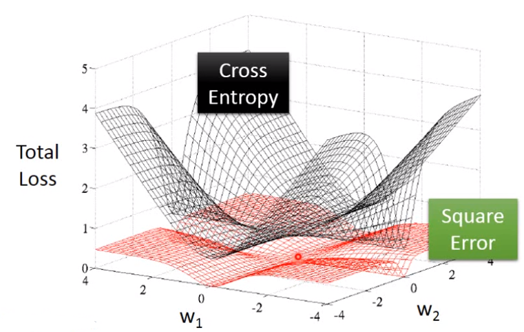
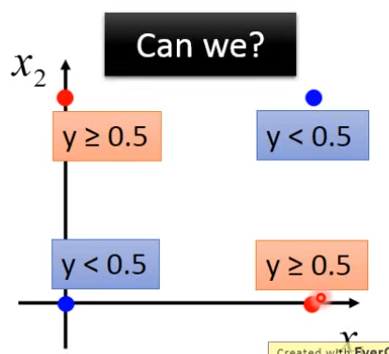

> 回顾：
>
> P(C)是prior probability
>
> P(x|C)是class dependent probability
>
> P(C|x)是posterior probability

想找到P(C|x)，如果P(C|x)大于一定阈值，我们就可认为x属于类别C

$f_{w,b}(x)=P_{w,b}(C_1|x)=\sigma(w\cdot x+b)$，其中$\sigma$就是sigmoid函数

注意上式中是假设在二元分类的背景下，因此$f_{w,b}(x)=P_{w,b}(C_1|x)$而$1-f_{w,b}(x)=P_{w,b}(C_2|x)$

逻辑回归就是寻找$w^*,b^*$使得$L$最大化
$$
L(w,b)=\prod P_{w,b}(C^i|x^i)
$$
等同于使
$$
w^*,b^*=\mathop {argmin}_{w.b}\ -lnL(w,b)
$$
令$\hat y^n=1\ for\ class1,0\ for\ class\ 2$，则
$$
-lnL(w,b)=\sum_n -\left[ \hat y^nlnf_{w,b}(x)+(1-\hat y^n)ln(1-f_{w,b}(x)) \right]
$$

> 这里的式子和交叉熵的式子相类似：
> $$
> H(p,q)=-\sum_x p(x)ln(q(x))
> $$
> 其中$p(x),q(x)$是分别x在两个概率模型中出现的概率，而用在上面的式子中则就是
> $$
> \begin{split}
> &p(x=1)=\hat y \\
> &p(x=0)=1-\hat y \\
> &q(x=1)=f(x) \\
> &q(x=0)=1-f(x)
> \end{split}
> $$
> 因此要想交叉熵尽量的小，则就是要让f(x)尽量和$\hat y$相同

对$-lnL(w,b)$做$w_i$的偏微分($w_i$是$w$的一个分量，记住$f$就是个sigmoid函数)，得
$$
\frac {\partial(-lnL(w,b))}{\partial w_i}=\sum_n-(\hat y^n-f_{w,b}(x^n))x^n_i
$$
更新步骤就是：
$$
w_i \leftarrow w_i-\eta\sum_n-(\hat y^n-f_{w,b}(x^n))x^n_i
$$
这个和线性回归中的更新式子完全一样（如果在线性回归中Loss前面乘个二分之一的话）。

## 为什么逻辑回归中的Loss Function不用Square Error?

如果在逻辑回归中用平方误差作为Loss，会得到
$$
\frac {\partial (f(x)-\hat y)^2}{\partial w_i}=2(f(x)-\hat y)f(x)(1-f(x))x_i
$$
当目标$\hat y$为0，而$f(x)$为1时，则gradient为0。

或目标$\hat y$为1，而$f(x)$为0时，则gradient也为0。因此不准确。

如下图，可以明显看出必须要用交叉熵。

## 逻辑回归Discriminative V.S. Generative

上一个markdown中我们说了：

**Generative的方法**就是给出样本$x^i$，我们计算出各个类别的$\mu^i, \Sigma^i$，且如果它们的$\Sigma$是共用的话，我们就可以得到类似$\sigma(w\cdot x+b)$的结果。

**逻辑回归方法**则不是直接计算出w和b，而是通过gradient descent的方式找到w和b。

老师说这两组w和b是不同的，因为假设前提不一样，例如Naive Bayes中认为各个属性的分布是独立的，这就导致有偏差。也就是说Generative的Model做了一些假设，而正是这些假设导致不同。

因此相当于说Generative的Model有采取假设，这种假设在训练数据很少的情况下会有一定的帮助，但是如果训练数据足够多，则这种假设就会导致误差。

> Multi-class Classification

## Softmax函数

> softmax函数就是用于**多分类**时的计算概率P(C|x)的
>
> PS：之前二分类时用的sigmoid和1-sigmoid作为两个类别的概率

输入z1, z2, z3，输出y1, y2, y3
$$
\begin{split}
y_i=\frac {e^{z_i}} {\sum_{j=1}^3 e^{z_j}}
\end{split}
$$
softmax函数就是使得最大值和其余值得差据拉得更大。

PS：softmax函数是有其数学原理，不是随便就找e作为底数的。

多分类问题中要优化的Loss也和之前的一样就是y和$\hat y$的交叉熵应最小，其中y和$\hat y$都是概率分布，不过$\hat y$是只有1个1其余全是0的向量。

## 逻辑回归的Limitation

因为前面所说的那样，逻辑回归也是在找$w,b$，因此也是一条直线，所以说对于如下这种情形的分类就办不到。

> 如果非要用逻辑回归解决上面的问题，则只有将上述的问题进行Feature Transformation特征转换（特征重新提取？），将其变为线性可分的两类数据即可。
>
> 例如可以把上图中的两个属性重新设计为：[到[0,0]的距离，到[1,1]的距离]，这样就可分了。
>
> 麻烦的就是在实际工作中，我们不知道怎么做有效的特征转换。

#### 让机器自己学习特征转换

就是让数据x先通过一个$\sigma (w_1\cdot x+b_1)$得到新属性$x_1'$，再通过$\sigma (w_2\cdot x+b_2)$得到新属性$x_2'$这样子。再拿$x_1'$和$x_2'$组成的$x'$通过$\sigma (w_3\cdot x'+b_3)$得到最终的概率。

**这个就是神经网络的雏形**。

