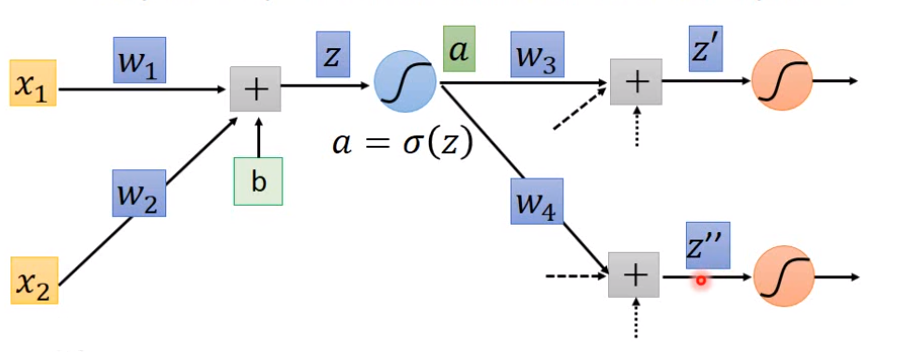
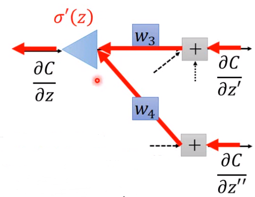

## Backpropagation

假设参数为$\theta$
$$
\theta=\lbrace w_1,w_2,\dots,b_1,b_2,\dots \rbrace \\
\theta_{t+1} \leftarrow \theta_t-\eta \nabla L(\theta^t)
$$
现在的问题就是如何快速有效地计算$\nabla L$

#### 数学背景知识：Chain Rule

$Case 1$：$y=g(x)\ z=h(y)$
$$
\frac {dz}{dx}=\frac {dz}{dy} \frac {dy}{dx}
$$
$Case2$：$x=g(s)\ y=h(s)\ z=k(x,y)$
$$
\frac {dz}{ds}=\frac {\partial z}{\partial x} \frac {dx}{ds} + \frac {\partial z}{\partial y} \frac {dy}{ds}
$$

回到Backpropagation上来，有：(其中$C^i$是第$i$个样本的输出$y$与数据标签$\hat y$的某种距离)
$$
\frac {\partial L(\theta)}{\partial w}=\sum_{n=1}^N \frac {\partial C^n(\theta)}{\partial w}
$$
对于一个神经元，有：
$$
z=x_1w_1+x_2w_2+b
$$
则：
$$
\frac {\partial C}{\partial w}=\frac {\partial C}{\partial z}\frac {\partial z}{\partial w}
$$

- Backpropagation中的Forward pass就是计算$z和\frac {\partial z}{\partial w}$
> 在本例中，$z=x_1w_1+x_2w_2+b$，$\frac {\partial z}{\partial w_1}$就是$x1$
- Backpropagation中的Backward pass就是计算$\frac {\partial C}{\partial z}$

#### Backward pass

>Backward pass较复杂，画图演示如下，假设各层神经元都只有2个

首先将$\frac {\partial C}{\partial z}$进行拆分：
$$
\frac {\partial C}{\partial z}=\frac {\partial C}{\partial a}\frac {\partial a}{\partial z}
$$
而$\frac {\partial a}{\partial z}$很简单，因为$a=\sigma (z)$，而sigmoid函数的微分为$\sigma'(z)=\sigma(z)(1-\sigma(z))$，因此
$$
\frac {\partial a}{\partial z}=\sigma'(z)=\sigma(z)(1-\sigma(z))
$$
再将$\frac {\partial C}{\partial a}$进行拆分：
$$
\frac {\partial C}{\partial a}=\frac {\partial C}{\partial z'}\frac {\partial z'}{\partial a}+\frac {\partial C}{\partial z''}\frac {\partial z''}{\partial a}
$$
而我们假设在计算$\frac {\partial C}{\partial z}$时，其前面的所有$\frac {\partial C}{\partial z'}$或$\frac {\partial C}{\partial z''}$之类的都已计算出来，因此这里我们只还需计算$\frac {\partial z'}{\partial a}$和$\frac {\partial z''}{\partial a}$即可：
$$
\frac {\partial z'}{\partial a}=w_3 \\
\frac {\partial z''}{\partial a}=w_4 
$$
因此我们便可得到$\frac {\partial C}{\partial z}$完整的计算公式：
$$
\frac {\partial C}{\partial z}=\frac {\partial C}{\partial a}\frac {\partial a}{\partial z}=\sigma'(z)\left[ w_3\frac {\partial C}{\partial z'}+w_4\frac {\partial C}{\partial z''} \right]
$$
**相当于**反向的一个forward pass，其input数据就是最后一层的$\frac {\partial C}{\partial z'}$

对于最后面一层的$\frac {\partial C}{\partial z'}$这种怎么算? 公式：
$$
\frac {\partial C}{\partial z'}=\frac {\partial y_1}{\partial z'}\frac {\partial C}{\partial y_1} \\
\frac {\partial C}{\partial z''}=\frac {\partial y_2}{\partial z''}\frac {\partial C}{\partial y_2} 
$$

