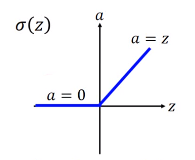
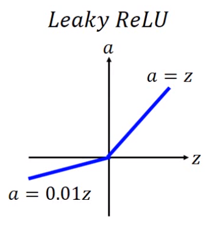

- 不要看到testing data上表现不好就认为是overfitting，有可能training data上就没训练好。
- dropout是overfitting时才用。

## Training Data Bad Results

一般在training data上表现不好就需要redesign network

#### Problem1：Vanishing Gradient Problem 梯度消失问题

靠近input的地方gradient很小（因为微分是**累乘**的），而靠近output的地方gradient很大，就导致后面层的更新步伐比前面层的大，因此会出现前面层的参数还是random状态时，后面的参数就基本上converge了。

因为sigmoid函数（或其他激活函数）会把input的一个很大的$\triangle w$映射成output的一个很小的$\triangle z$。

- 后来改用ReLU替代sigmoid作为激活函数后可改善该问题

  

  ReLU代替sigmoid之后，则network中的一个neuron要么输出为0，要么output=input，因此把所有输出为0的neuron删除后，整个network就变成了没有激活函数的Linear Network，而这种网络就不需要担心梯度消失的问题。

  > 1. 老师说用ReLU并不会导致网络变成Linear的，因为在输入变化较大时神经元的operation region会发生改变？（没听明白）
  >
  > 2. ReLU是否可微分，可，只要不在刚好原点上（老师说不可能在原点）。

- ReLU的修改版Leaky ReLU，则是考虑了当z为负数时输出全为0的缺陷。

  

- 同样还有Parametric ReLU，就是a=0.01z变成了a=$\alpha$z，其中$\alpha$由梯度下降学习得到。

- 自动学习激活函数的方法**Maxout**：就是把一层神经元的输出分组，每组输出最大值作为该组的输出。类似CNN中的max-pooling。

  Maxout可以训练出ReLU，因为相当于ReLU就是max(0, x)只要x大于0，输出就是x否则就是0。

  Maxout训练出的激活函数就差不多是个分段函数（差不多），一组内有多少个数据，一般来说就相当于有几段（how many pieces）。

  - Maxout的训练方法：

    将network因为不是最大值而被忽略的神经元全部拿掉，剩下的就是一个thin and linear network，因此训练就是只训练这部分神经元。

    不必担心那些被忽略的神经元不会被训练掉，因为数据不同，因此每次maxout选择的那个神经元不会一直相同，因此各个神经元均会参与训练。

#### Problem2：Adaptive Learning Rate

- 用RMSProp，在"NewOptimization"中已有介绍，这里略。

#### Problem3：如何避免卡在"平原"或局部最优点

老师说一般来说局部最优点不会那么多，因为要是局部最优点必须每个dimension上都要是微分为0，而network越大，维度越多，这样的局部最优点出现的概率越小。

- 用Momentum，在"NewOptimization"中已有介绍，这里略。

## Testing Data Bad Results

#### Tip1：Early Stopping

很简单，就是将训练数据中切分出validation data，在训练过程中关注Model在validation data上的表现，如果表现开始变差时，就可以停止训练了，即使此时在training data上的准确率还在上升趋势中。

#### Tip2：Regularization

> 这部分在"01_Regression.md"中已有介绍，部分略。

**如果是L2正则项**：
$$
w_{t+1} \leftarrow w_t-\eta \frac {\partial L'}{\partial w} = (1-\eta \lambda)w_t-\eta \frac {\partial L}{\partial w}
$$

如果是L1正则项：
$$
||\theta||_1=|w_1|+|w_2|+\dots
$$
仍然是可以微分的，就是
$$
\frac {\partial (||\theta||_1)}{\partial w_i}=
\left \{ \begin{matrix}
1&if&w_i>0 \\
0&if&w_i=0 \\
-1&if&w_i<0
\end{matrix} \right. 
$$
于是（$L'$代表是加了L1正则项的Loss）
$$
\frac {\partial L'}{\partial w}=\frac {\partial L}{\partial w}+\lambda sgn(w)
$$
**那么**：
$$
w_{t+1} \leftarrow w_t-\eta \frac {\partial L}{\partial w}-\eta \lambda sgn(w_t)
$$
从上面L1和L2正则项分别推出的最后式子来看，应用L1正则项就是导致w每次减少/增加一个固定的值，而L2正则项就是导致w每次乘以一个小于1的值。

因此L2正则项会导致w下降很快（例如$0.999^{1000}\approx 0.36$），而L1正则项就很慢（例如w=10000，每次减少0.0001，则1000次后w=10000-1000*0.0001=9999.9）很明显，当w很大时，L1下降得非常慢。

因此用L2正则项训练出的最后结果参数中普遍都很小但基本不为0，而L1正则项训练出的模型参数中则既有很大的值，也有很多**0**。

#### Tip3：Dropout

就是在每次更新参数时，对所有神经元进行概率性的dropout，被丢弃的神经元不参与此次参数更新。（一般是每次更新参数前就进行选取神经元的工作，在实际代码中一般是对每个mini-batch的数据进行更新一次）（这部分具体细节也没完全明白）

但在testing的时候，则不进行dropout，但是将所有的weight进行缩小，都乘以(1-p%)，这里的p%是神经元之前dropout中被丢弃的概率。

因为比如dropout就是请假，则在训练时有p%的神经元都不会贡献力量，而在testing中，所有神经元都到场了，因此每个神经元就只需要出(1-p%)的力气就好了。

Dropout实际上是一种集成学习的思想，相当于每次训练整个网络中的一个子网络（不同子网络中部分参数是shared），等到最后再组合起来求一个平均值作为最后网络的输出。

但实际上这种把weight乘以(1-p%)后才能使网络在testing时的输出approximate training时的输出只有在网络接近是Linear的时候才成立，因此Dropout在ReLU或Maxout等逼近线性的网络上效果比较好。