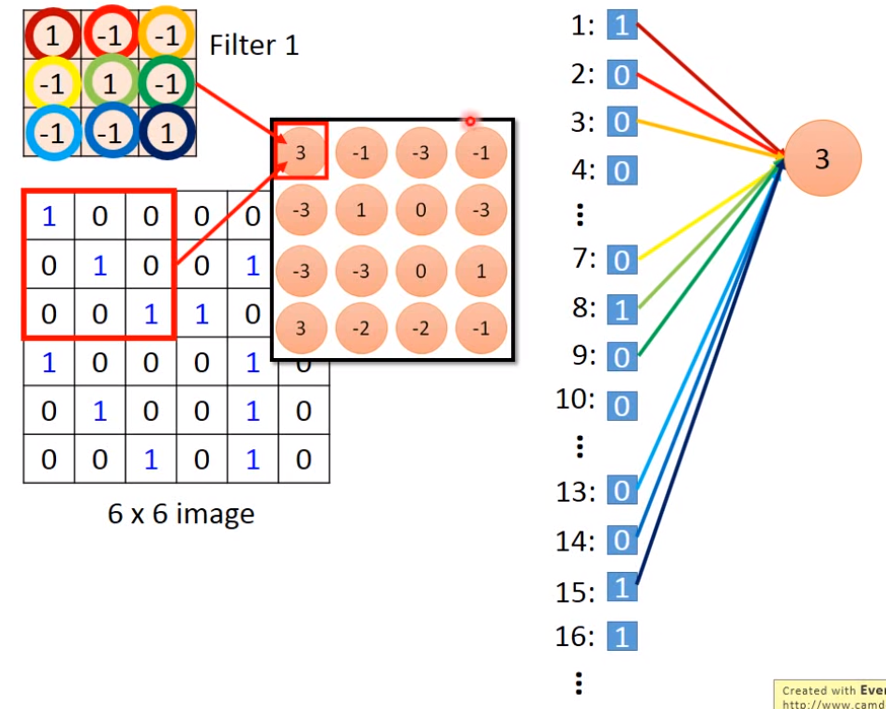

> 传统的Full Connected网络处理图像所需的参数数量太大。

1. 如果说神经网络某一层的某一个神经元是为了检测图像中某个pattern（例如检测条纹、检测横线之类的）有没有出现的话，并不需要和前一层所有的输出都有连接，因此部分weight是可以省去的。对于人类来说，就是说只需看部分图片即可。

2. 且这个子图在原图中的位置应该是没关系的。

3. 且原图的大小也应该是无关的，例如我们把原图的偶数行偶数列拿掉后从外看起来应该是不影响人类的识别的。

> 1和2用Convolution实现，3用MaxPooling实现


## CNN基础

CNN的基本架构：

$Convolution \rightarrow MaxPooling\rightarrow Convolution\rightarrow MaxPooling\rightarrow \dots \rightarrow Flatten\rightarrow FullyConnectedNetwork$


每一个卷积核里面的权重矩阵是需要被学出来的。每个卷积核会产生一个Feature Map。

>例如卷积核
>$$
>\left[ \begin{matrix}
>1&-1&-1 \\-1&1&-1 \\-1&-1&1
>\end{matrix} \right]
>$$
>就是检测有没有一条从左上到右下的一条直线。

如果是3个channel的图片，则卷积核是一个大小$3*n*m$的核，相当于高是3。


一个次卷积只会产生一个值，不会说因为3个channel就一次卷积操作生成$3*1$的向量，因此穿过多层Convolution不会导致FeatureMap层数过高，例如两层Conv每层都有25个卷积核，则输出的层数也只有25个，而非$25^2=625$个


## CNN类比DNN

为什么说CNN是简化后的DNN? 如下图**每次卷积操作都可以看作是一个中间神经元**。



CNN的训练就是类似全连接网络的训练，其中权重为0的边不会参与训练，且一些边是share weight的，在实际中可以把应该share weight的边都求gradient，然后加起来求均值再去更新每个权重，以保持权重相同（也就是共享权重）


MaxPooling就是和Maxout类似的微分方法。


Flatten就是把输出的立方体数据给排列成一个向量就可以扔进后面的Fully Connected网络中。


## CNN代码示例

```python
#一般只有第一层才需要告诉input_shape
#PyTorch中的Conv,25个卷积核，每个3*3,输入的图像矩阵为(1,28,28)
model.add(Convolution2D(25,3,3, input_shape=(1,28,28)))
#PyTorch中的MaxPooling,(2,2)告诉是在2*2的框中选取最大值
model.add(MaxPooling2D((2,2)))
#PyTorch中的Flatten
model.add(Flatten())
#PyTorch中的Fully Connected
model.add(Dense(output_dim=100))
model.add(Activation('relu'))
model.add(Dense(output_dim=10))
model.add(Activation('softmax'))
```


## CNN分析

我们可以把Filter的一个输出，即FeatureMap中的所有元素之和看作是这个Filter的degree of the activation。

例如下图就是分别使4个卷积核兴奋程度最大的输入图像，很明显的看到第3个卷积核探测的就是图上是否有斜条纹，如果全是斜条纹就activate最大。


例如下图就是分别使全连接网络中的某个神经元输出最大的输入图像，很明显地看到一个神经元是在检测整张图片，而不再像上面的只是探测某种texture。


例如下图就是分别使output层中的某个神经元输出最大的输入图像，很明显0不像0，1不像1，也就是说CNN学到的东西和人类理解还是差别挺大。


但是如果限制“墨水”的使用量，则使output层各个神经元输出最大的图像如下，可以看到还是能看出一点点。


> 这些图中白色的部分才是代表有颜色的。原论文中是针对MINIST手写数字的CNN进行的分析，因此图中的白色才是代表输入图像中的黑色。


## DeepStyle

一张图片的Style就是不同Filter的FeatureMap之间的Correlation，因此一些接受一张图生成某种风格的图片就可以这样做：

- 采用gradient ascent梯度上升的方法，去使图片和原本图片的FeatureMap的Value相似，但是FeatureMap之间的Correlation又和一张风格的图片相似，就可以得到一张内容像原本图片，但风格完全不同的新图片。


> 什么时候该用CNN?

The same patterns appear in different region.

Subsampling the pixels will not change the object.


> PS：AlphaGO中的CNN没用MaxPooling，因为围棋局势不像图像那样抽了几行几列仍然不影响外观，AlphaGO中是$19*19$的图，但并不是实际的图，而是代表围棋棋盘19行19列，因此不能抽掉其中的几行或几列，所以实际AlphaGO中的CNN没用MaxPooling。

> PS：把CNN运用到Spectirum图中试图阅读每一帧的音素，则一般每一帧的那部分Spectrum一般Filter只会在不同的频率中移动，而它的宽度就是跨越整个时间段的，也即是和窗口大小相同。
>
> 

> PS：把CNN运用到句子情感识别时，则一般Filter就只会在时间的维度上移动了，而在word vector上不同的维度的移动是没有意义的。（老师说）因为在word embedding中的word vector的每个dim的含义是独立的。
>
> 


**也就是说一般Fliter移动时必须考虑相似的Patterns是否可以出现的不同的地方，这样移动才有意义**！

