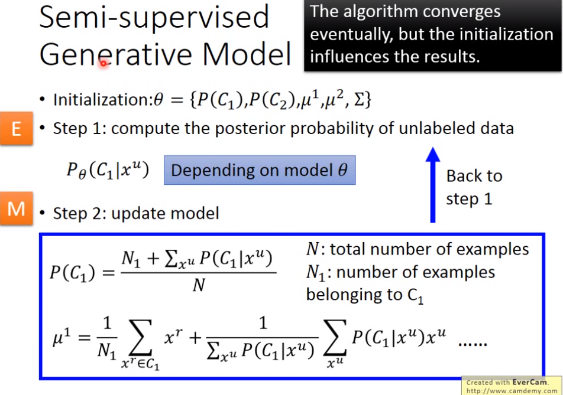
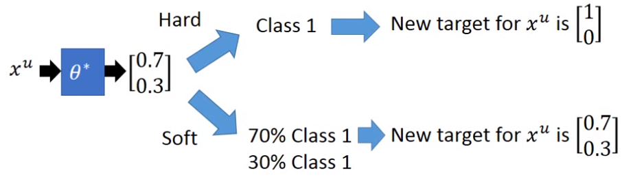
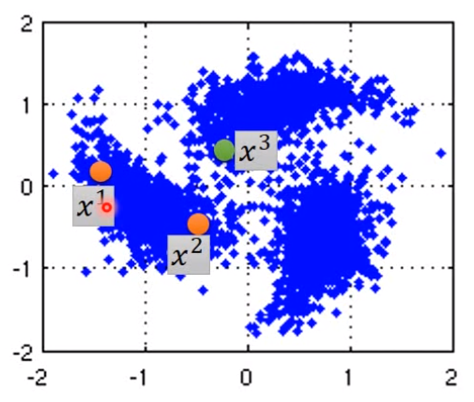
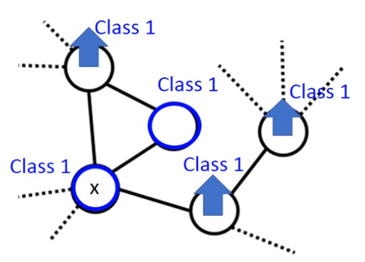
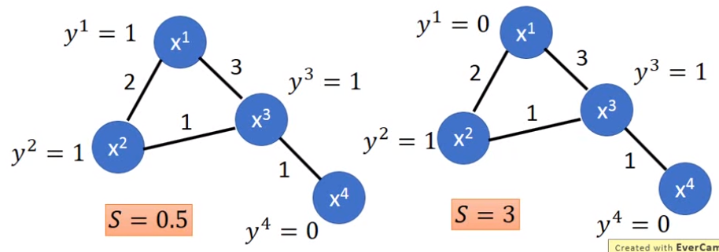
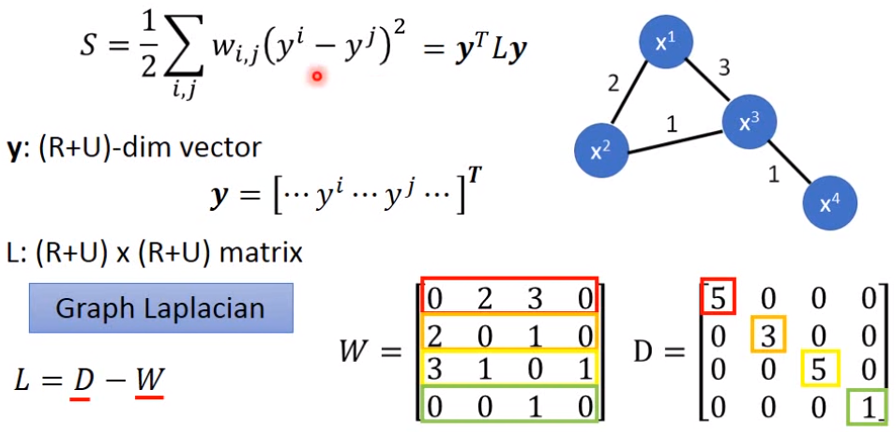

> 半监督学习，就是常见的有一部分labeled的数据，还有很大一部分unlabeled的数据，这和实际场景非常相像。

半监督学习分为Transductive learning和Inductive learning，其中Transductive learning是指Model在训练时会用到unlabeled的Feature，也就是在应用时Model已经见过测试数据了只是不知道其label而已。而Inductive则是Model完全没见过unlabled的data。

## Semi-supervised Learning for Generative Model

假设有两类$C_1,C_2$，样本数据$x$，$P(x|C_i)$是一个高斯分布，假设两类别的多维高斯分布共用协方差矩阵$\Sigma$
$$
P(C_1|x)=\frac {P(x|C_1)P(C_1)}{P(x|C_1)P(C_1)+P(x|C_2)P(C_2)}
$$
对之前的分类问题做Semi-supervised Learning则得到

相当于对原来的$\mu,P(C)$等进行考虑了unlabeled data的操作。

> 疑问：上图中没有介绍$\Sigma$是如何更新的？

上述操作的数学原理就是想让$logL(\theta)$尽量大，$\theta$是参数集合，其中$x^r$是labeled data，而$x^u$则是来自unlabeled data：
$$
logL(\theta)=\sum_{x^r}logP_\theta(x^r,\hat y^r)+\sum_{x^u}logP_\theta(x^u) \\
P_\theta(x^u)=P_\theta(x^u,C_1)+P_\theta(x^u,C_2) \\
其中 \\
P_{\theta}(x^r,\hat y^r)=P_{\theta}(x^r|\hat y^r)P_{\theta}(\hat y^r)
$$
相当于就是给unlabeled的样本一个soft label，即认为unlabeled data是各个class的都有，只不过占比不同。

## Semi-supervised Learning Low-density Separation

就是说在划不同class的分界线时，尽量去找unlabeled data分布稀疏的位置。相当于把国境线设在荒郊野岭的这种感觉。

> 相当于low-density separation的思想就是"这是个非黑即白的世界"，不会有一个data既像class1又像class2.

#### self-training

self-training的做法就是说在labeled data训练出个模型f，然后用f去预测unlabeled data的标签，从中选择**可信度较大的标签与其data**一起加入到labeled data，然后重复这个过程。

> 在Regression任务中这个方法没用，因为新的$(x,y)$就是从当前f中产生，再返回去也不会影响f

相当于是给unlabeled的样本一个hard label。

#### soft label VS hard label

老师说soft label不会work，只有hard label会稍微有点用，因为soft label的数据不会去影响f。
（注意在regression任务中hard label也没用，因为regression任务的label就是个实数）

#### Entropy-based Regularization

为了使data尽量"非黑即白"，我们肯定希望数据类别概率分布是十分集中而不是分散的，因此可以用信息轮中的”自信息量“E来衡量这个。因此就有了新的Loss（考虑了unlabeled data的Loss）
$$
L=\sum_{x^r}C(y^r,\hat y^r)+\lambda\sum_{x^u}E(y^u) \\
E(y^u)=-\sum_{m=1}^n y_m^uln(y_m^u)\quad 假设有n个class
$$
新的Loss是可以微分的。

#### Semi-supervised SVM

SVM还没讲，但大致SVM可看作就是去超平面上画一条线把不同类别的样本分开。

Semi-supervised SVM的思想就是说穷举所有unlabeled data属于不同的类别的所有可能性，对每种可能的情况都做一次SVM去画分界线，从中选择分类错误率最小，且各个类离分界线距离(margin)最大的一条线作为最后的分界线。

paper中说肯定不可能穷举完所有可能情况($2^N$)，因此作者的妥协方案是先为每个unlabeled数据随机打一个标签，然后不断尝试修改其中一个unlabeled数据的标签，如果能使最后的结果变好就改否则就取消这次尝试修改。

## Semi-supervised Learning Smoothness Assumption

> 其精神就是"近朱者赤，近墨者黑"，就是说如果$x$相似的数据，其$\hat y$也应该相似。
>
> 更确切地说，相似者必须应该在同一个高密度区域，例如下图中即使x2和x3很近但其实x1和x2才是在同一个高密度区域。（通过一个high density path相连）
>
> 

#### Smoothness Assumption的实现算法：Cluster and then Label

就是先聚类，然后为每个类别分配一个标签就好了0.0

例如，用deep autoencoder为image编码形成vector，再把这些vector进行clustering，然后labeling

#### Smoothness Assumption的实现算法：Graph-based Approach

> 将每个样本看作图上一个节点，先建立好图

1. 定义好相似度计算函数$s(x^i, x^j)$

   Gaussian Radial Basis Function：
   $$
   s(x^i, x^j)=exp(-\gamma||x^i-x^j||^2)
   $$

2. 根据某些准则进行加边

   - K Nearest Neighbor：选择和自己最近的k个邻居加边
   - e-Neighborhood：选择和自己的距离在一定阈值$e$内的邻居进行加边

   > 边是可以有weight的

3. "传染"模型

   

   就是说labeled data会把自己的class通过图结构不断地传递扩散出去。（具体算法没讲）

   > 这种一般要data足够多，例如data少了，则很可能本来应该相连的点集合就因为中间缺一些数据而断掉了。

4. 计算图的smoothness的公式（$\frac 12$没意义）
   $$
   S=\frac 12\sum_{i,j} w_{i,j}(y^i-y^j)^2
   $$
   例如下图，显然S越小越好。

   

   S的公式可以进一步化为矩阵乘法形式，例如下图，其中L称为Graph Laplacian
   > W是边weight的矩阵，D是每一行之和然后填写到对角线上形成，证明的话自己展开就知道

   

5. 有了S之后，就可以加入到Loss中进行训练
   $$
   L=\sum_{x^r}C(y^r, \hat y^r)+\lambda S
   $$

   > 从上式也可以看到，我们也可以在中间层上应用图结构，即认为中间层的输出根据这个图结构也应该是smooth的

