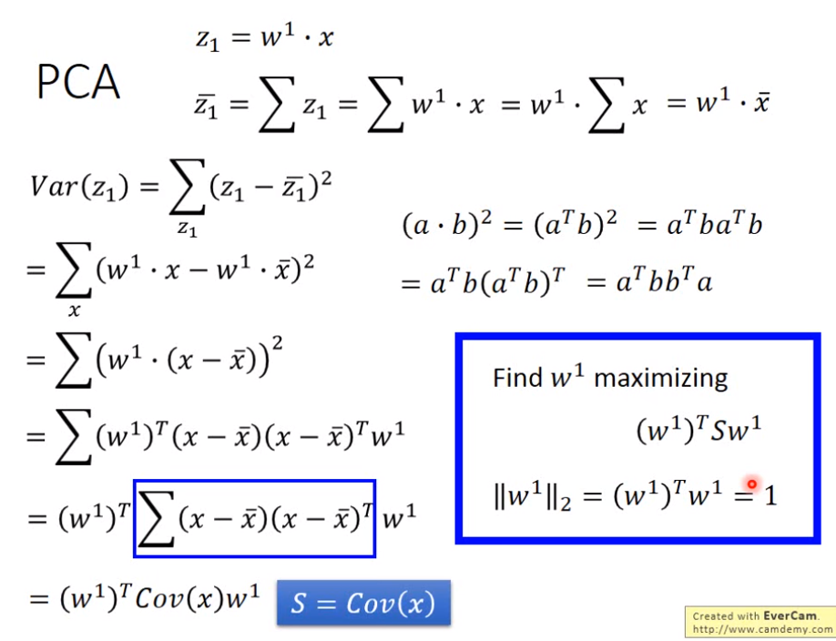
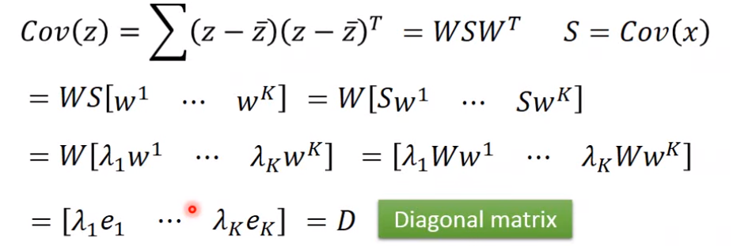
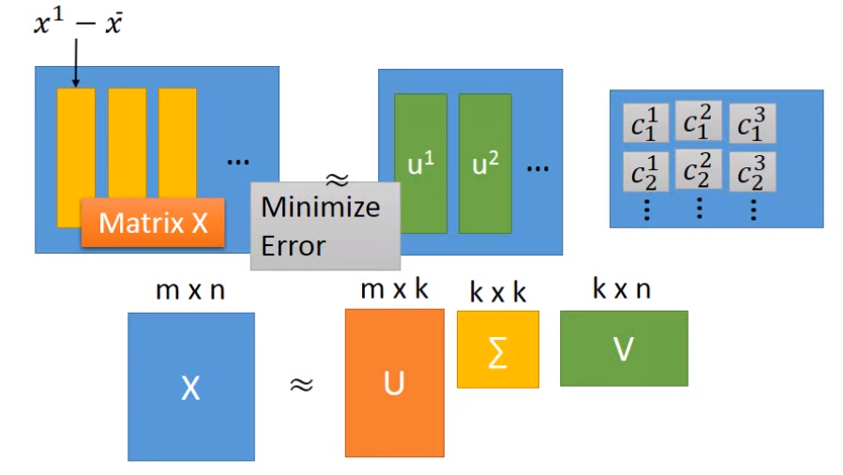
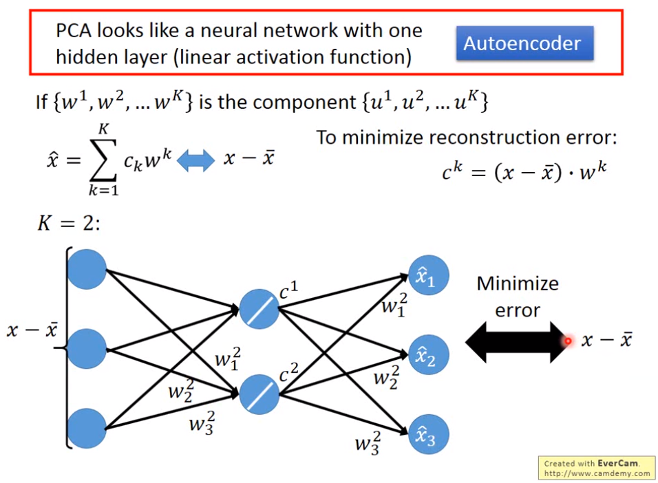
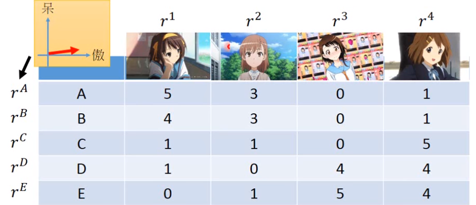
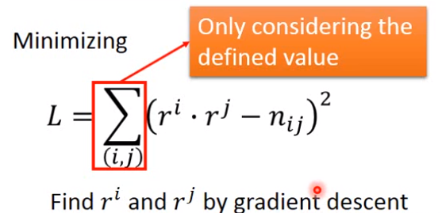
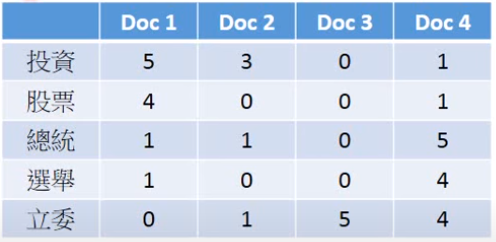

> Unsupervised Learning
>
> - Clustering
> - Dimension Reduction
> - Generation

## Clustering

#### K-means

把样本分为k个类

1. 随机选择k个样本作为k个类的中心
2. 遍历所有样本，将每个样本归类到离它最近的一个中心
3. 更新一个类的中心为其所有成员的平均值；

#### HAC

1. 不断合并，建立一个tree结构

2. 根据一个threshold，在树结构上选择一个level进行切断，然后就ok了

## Dimension Reduction

如何判断是否该对数据降维？例如MNIST，每个样本是28*28的向量，如果随机抽取这样一个向量，那么大部分是一个杂乱的一个图片，因此我们可以说在784维的数据分布空间里太空了，因此这时我们可以考虑降维。

#### Feature Selection

这种降维方法就是人为地丢弃一些属性。

#### PCA

公式如下，n代表降到n维：
$$
z_n=w^n \cdot x \\
其中||w^n||_2=1
$$
我们希望$x$经过投影后的$z_n$之间的方差越大越好。因此相当于想要最大化$Var(z_n)$
$$
Var(z_n)=\sum_{z_n}(z_n-\overline {x_n})^2
$$
同时必须保证不同的$w_i$之间必须是正交的。

> 这里我之前理解错误的一点是，我以为$z_n$这种是一个n维的向量，但实际上$z_n$这种都是一个标量，而是[$z_1,z_2,\dots , z_n$]组成了n维的向量
>
> 而每个$w^i$就是一行。

**数学推导**

#### PCA最后的结论

使得$(w^1)^TCov(x)w^1$最大的$w^1$就是**Cov(x)最大的特征值对应的特征向量**。且$(w^1)^TCov(x)w^1$的最大值就是最大的那个特征值。

使得$(w^2)^TCov(x)w^2$最大的$w^2$就是**Cov(x)第二大的特征值对应的特征向量**。...

PCA后产生的$z$的**相关矩阵是对角矩阵**，相当于说$z$**的各维度之间是不相关的**。

#### PCA中的另一解释

把$x$看作是$c_1 \vec {u_1}+c_2 \vec {u_2}+\cdots +c_k \vec {u_k}+\bar x$，那么$x$就可以用$[c_1,c_2,\dots,c_k]$表示

令$\hat x=x-\bar x=c_1 \vec {u_1}+c_2 \vec {u_2}+\cdots +c_k \vec {u_k}$

> 相当于就是求$[c_1,c_2,\dots,c_k]$和$[\vec {u_1},\vec {u_2},\dots ,\vec {u_k}]$点积使得其值和$x-\bar x$逼近，这一步可用SVD分解，且刚好SVD分解后的矩阵U其中的每列都是互相正交的，且对应着前k大特征值的特征向量，因此就刚好是上面的$w$的每行。
>
> PS：SVD分解的公式
> $$
> XX^T=U\Sigma V
> $$
> 可以说对$x-\bar x$做SVD得到的U中每列就是PCA得到的$w$的每行.（老师说把$\Sigma$并到左边或者右边都可以）
>
> 而因为$\vec w_i$之间正交，因此把$x-\bar x$拿去和$\vec w_i$相乘就可以得到对应的系数$c_i$.
>
> 这也是为什么PCA求出$w$，我们$w \cdot x$就可以拿到对应的$[c_1,c_2,\dots,c_k]$
>
> 

#### Autoencoder的起源PCA

因为发现$c_k=(x-\bar x)\cdot \vec {w_k}$就可以用神经网络表示，且用c1,c2,...又可以组合成$\hat x$，因此就出现了Autoencoder的思想：

Neural Network训练出的$w$和实际PCA解出的$w$是不一定相同的。

#### PCA的弱点

1. unsupervised

   没有考虑数据的label，因此可能会把在高维空间分开的两堆数据在低维空间上反而混杂在一起。

   > 拓展：考虑label的降维是LDA

2. linear

#### 降维的维数

一般来说可以根据$Cov(x)$中各个特征值的大小来决定保留哪几维度，例如假设5维的$x$，其Cov(x)的前5个特征值比例是[0.4, 0.3 ,0.2, 0.05, 0.05]那么就可以说舍去后面两个特征值对应的那个$\vec {w_i}$，即降至3维。

> 拓展：如果用NMF（只提了一下）而不是PCA，则其所有元素都是正的，且所有$w_i$也是正的元素组成，这就会导致例如MNIST这种数据中的$w_i$都像某一笔画那样

#### Matrix Factorization

Matrix Factorization矩阵分解就是用数学的方法求一些样本背后的latenet code

> 例如，我们手上有一个人购买日本动漫的份数的数据，则就可以把ABC三个人视为三个向量$r_A,r_B,r_C$，而把三个动漫也视为向量$r_1,r_2,r_3$，而基于假设"人和动漫的latent code越相像，则人购买该动漫的份数就越多"，而去求各个人和动漫的latent code就相当于是做矩阵分解
>
> 
>
> 如果有些数据缺失，则可以不用矩阵分解，而使用梯度下降方法（只用那些已知的数据），这样还可以去预测未知的数据。
>
> 
> 当然还可以修正一下L的公式，因为我们考虑每个人买各个动漫时候并不只考虑其latent code是否相似，而且还应考虑这个人是否有钱$b_i$、以及那个动漫是否好看$b_j$之类的特定个体因素，则L应变为
> $$
> L=\sum_{(i,j)}(r_i\dot r_j+b_i+b_j-n_{ij})^2
> $$
> 

> Matrix Factorization矩阵分解可以用来latent semantic analysis，就是把上面的人换成词汇，动漫换成文件，求出的latent code就代表一个词汇 or 文件的中心思想的分布情况，例如[0.1,0.9]就可以说是10%的政治相关、90%的环境相关等等。
>
> 
