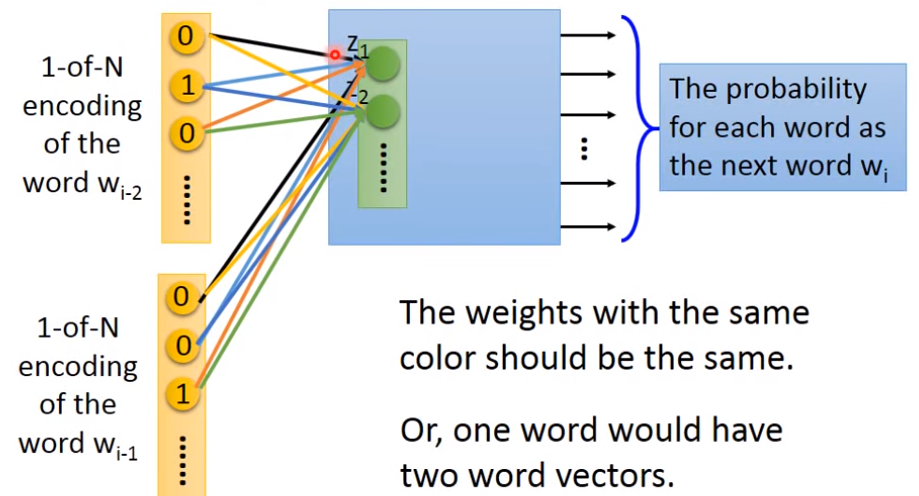

> 1 of N Encoding就是one-hot编码；

# Word Embedding

- Word Embedding不能用Auto-encoder来进行

  首先，Word Embedding需要输入数据，如果我们输入的标签就是one-hot编码的话，那么one-hot编码之间不存在任何关联关系，因此也就无法学出一个有用的word vector。

- Word Embedding是通过上下文Context来学习一个词的含义

#### Count Based

Count Based方法来找一个词的word vector，大概思想就是说
$$
V(W_i)\cdot V(W_j)=N_{i,j}
$$
其中$N_{i,j}$是两个word共同出现在一个document的次数，因此找word vector就可以变为矩阵分解的问题。

#### Prediction Based

输入是one-hot编码，输出是下一个词的概率，因为考虑了下一个word的概率，所以这种模型的hidden layer输出可以当作一种word vector。

根据前两个词预测下一个词的概率，此时我们让$w_{i-2}$和$w_{i-1}$到隐藏向量$z$的各边权重相等，例如$w_{i-2}$到$z_1$的权值和$w_{i-1}$到$z_1$的权值相等。（上图中相同颜色的边权值相同）这样做的目的是让word位置对结果$z$无关，同时有效减少参数的数量。

如何使某两个参数$w_i$和$w_j$保持相同：

#### Prediction Based的变形

Continuous bag of word model (CBOW)：给一个词的上下文，预测中间这个词

Skip-gram：给一个词，预测其上下文的词

