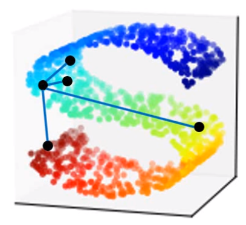

> 在高维空间的数据如果是非线性分布，那么很可能一些距离很近的点其实际距离很远，例如下图中的蓝色点和黄色点、蓝色点和红色点，本来应该是蓝色点和黄色点更接近。
>
> 

## Locally Linear Embedding（LLE）

这个方法考虑到了上述的"当距离较远时，传统的距离函数可能失效"的问题。

首先为一个点$x$选择k个最近的邻居（k是可调参数），我们就可以用k个最近的邻居线性组合成这个点$x$，LLE的目的就是去降维后的空间寻找对应降维后的数据，同时使其依然满足之前的线性组合关系，即$x$降维后形成$z$，但$z$和刚才那k个降维后的邻居的这种线性组合的权重没变。

## Laplacian Eigenmaps

这个方法和之前的semi-supervised learning中的smooth assumption中的公式S差不多。

采用的假设是"如果在原本的空间中$x_1$和$x_2$ are close in a high density region，那么降维后的$z_1$和$z_2$也应该是相近的"

即让$S=\frac 12 \sum_{i,j} w_{i,j}(z^i-z^j)^2$必须足够小，且{$z^1, z^2, \dots, z^N$}的维度必须占满M维度（假设$z$的dim是M）之所以有后面这个占满维度的要求，就是避免$z$全0后S就为最小的0了。

这样最后解出来的$z$们就是之前semi-supervised中提到的laplacian矩阵的比较小的特征值对应的特征向量。

## T-distributed Stochastic Neighbor Embedding(t-SNE)

前面的方法只考虑了"相近的点在**降维**后也要相近"，但是没考虑"不相近的点在**降维**后要远离"。

1. 首先计算在原数据之间的Similarity $S(x^i, x^j)$

2. 然后再计算出：
   $$
   P(x^j|x^i)=\frac {S(x^i,x^j)}{\sum_{k\ne i}S(x^i,x^k)}
   $$
   

3. 之后计算在降维后的数据之间的Similarity $S'(z^i, z^j)$

4. 然后再计算出：
   $$
   Q(z^j|z^i)=\frac {S'(z^i,z^j)}{\sum_{k\ne i}S'(z^i,z^k)}
   $$

5. 现在我们就是想找到一组$z$，使得概率分布P和Q之间越接近越好，即
   $$
   L=\sum_i KL(P(*|x^i)||Q(*|z^i))
   $$
   L越小越好。用gradient descent求L即可。

一般来说t-SNE需要的计算量很大，因此一般可以用PCA先降到一定程度维数，之后再做t-SNE进一步降维。

> 以上这几种方法都不能做到对于没见过的$x$就立马降维的程度，因此只适合对已有数据进行降维后进行分析的任务；

t-SNE是现在最常用的一种方法。

t-SNE和SNE方法不同之处就在于，t-SNE在降维后的空间$z$中的similarity和之前的similarity函数不同，t-SNE的降维后的similarity是T-distribution中的一种函数（T-distribution有很多种分布函数）。

而重要的就是这个$S'$函数是T-distribution，正是因为$S'$变了，使得在之前$x$中$S$很小、很近的点在变换后的$S'$依然很小，但是会让之前$x$中$S$较大的点在变换后的$S'$被增大，增强了差距。

