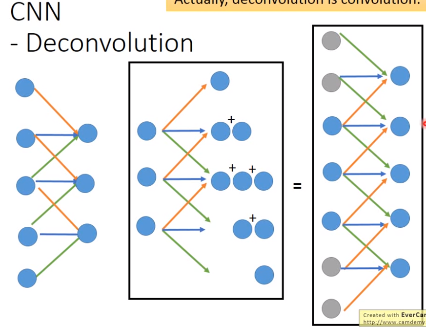

- 一般input数据通过normalize就可以变成mean是0，var是1；不经过normalize的数据必须减去其均值再输入到encoder中。

> 回顾PCA（在第13个md）：
>
> 在PCA中，我们也是输入$x$，然后通过**linear**的hidden layer得到$c$，然后再通过linear的hidden layer得到$\hat x$，我们希望$x$和$\hat x$越接近越好。
>
> PCA只有两层的hidden layer，且前后两层hidden layer的weight是共享（只不过呈转置关系，一个是$w$，另一个是$w^T$）的。

> AutoEncoder就是把层数变多的PCA，**并不需要两边的hidden laryer是对称的**。

AutoEncoder的中间code如果比输入数据的维度都还大，那么就需要注意加上regularization（例如L1或L2正则项）。避免模型单纯的复制输入到输出，例如输入784维度，code1000维度，输出784维，那么code完全就可以只复制输入的784维到自己的前784维上即可。

### AutoEncoder用于Pre-training DNN

假设我们想训练一个左边的网络，我们就可以按右边先encode-decode得到$W^1$，同样地，对于后面的1000、500的层也可以这样训练得到$W^2,W^3$，之后就用这些$W$去初始化神经网络然后开始真正地训练。

Pre-training就是给神经网络找到一个好的初始值。（现在基本可以不用Pre-training，不过也可以先用unlabeled data进行这样的pre-training）

### De-noising Auto-Encoder

把数据加上噪声，进行encode-decode训练，使decode的输出和没有噪声的数据尽量接近。

### Auto-encoder for CNN

1. Unpooling

   Unpooling就是把原来"几个当中选一个max"反过来，即"把每个都填充为max"值。

2. Deconvolution

   Deconvolution仍然还是conv的操作，不过是先填充0(padding)，再做conv。

   