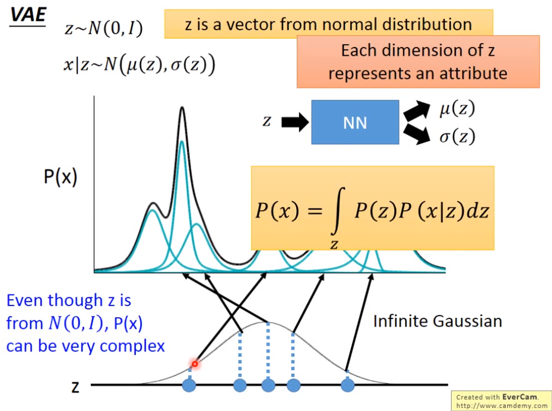

# VAE

> 上图中的Minimize下面的公式前面少了个负号，应该是minimize：
> $$
> \sum (exp(\sigma_i)-(1+\sigma_i)+(m_i)^2)
> $$

VAE输出的$m$相当于是原来AE输出的code，$c$代表是加上noise的code，$\sigma$代表noise的variance（the variance of noise is automatically learned），取出来的$\sigma$会先进行exp指数计算，目的是得到一个非负数保证方差为正，$e$是从normal distribution抽取的。

为了让VAE不会把$\sigma$越学越小（当$\sigma$为负无穷时，noise的方差为0，此时相当于噪声就没有了，退化成AE），为了避免这样，因此就需要最小化下面的值：
$$
\sum (exp(\sigma_i)-(1+\sigma_i)+(m_i)^2)
$$
上面函数$exp(\sigma_i)-(1+\sigma_i)$部分在$\sigma_i=0$时取最小，而$\sigma_i=0$时方差为1不会为0，因此就保证机器学习不会朝着noise为0的方向去学习。

而公式中最后的$m_i^2$的目的是L2正则项。（老师没怎么说m的原因）

### Why VAE?

VAE比之前的AE的不同是，之前的AE只要求输入一个数据$x$，然后AE需要输出$\hat x$逼近$x$。VAE就是说输入进来的数据$x$会加上噪声noise，然后VAE会尽量输出$\hat x$。因此VAE的latent code即使取中间的值也是会有一定意义的。

VAE的目的就是Model出原始数据的分布$P(x)$，（使得那些长得像宝可梦的图片$x$出现的几率大，怪怪的图出现的概率就很小）

### 数学背景知识 Gaussian Mixture Model

把复杂的概率分布看作是一组高斯分布通过不同的weight组合起来的，每次要抽样一个$x$，就先抽取一个高斯分布，再去这个高斯分布中抽取一个样本$x$。（类似分类问题一样，每一个我们看到的$x$，都是来自于某一个分类的）
$$
P(x)=\sum_m P(m)P(x|m)
$$
老师说Gaussian Mixture Model在给定data的情况下通过EM方法很容易得到。

老师说VAE就是Gaussian Mixture Model的Distribution Representation版本，具体如下：

上图就是先从标准正态分布中抽取$z$，然后z通过一个function（NN）可以得到这个$z$对应的高斯分布的$\mu(z),\sigma(z)$，因此P(x)就可以表示为
$$
P(x)=\int_z P(x)P(x|z)dz
$$
我们已有一笔数据$x$，VAE就是用来找到一个function（NN），可以根据$z$产生对应的$\mu,\sigma$，使得L最大。
$$
L=\sum_x logP(x)
$$

### VAE数学原理

1. 首先有两个分布，p(x|z)和q(z|x)，p(z)是标准正态分布.

   p(x|z)就想成，根据z生成$\mu,\sigma$，代表x的高斯分布；

   q(z|x)就想成，根据x生成$\mu,\sigma$，代表"**x所最有可能来自的高斯分布是由哪个z生成的这个z**"的高斯分布；

2. 然后是$logP(x)=\int_z q(z|x)logP(x)dz$，因为$\int_z q(z|x)dz=1$

   然后是				$=\int_z q(z|x)log(\frac {P(z,x)}{P(z|x)})dz$

   ​							$=\int_z q(z|x)log(\frac {P(z,x)q(z|x)}{q(z|x)P(z|x)})dz$

   ​							$=\int_z q(z|x)log(\frac {P(z,x)}{q(z|x)})dz+\int_z q(z|x)log(\frac {q(z|x)}{P(z|x)})dz$

   ​							$=\int_z q(z|x)log(\frac {P(z,x)}{q(z|x)})dz+KL$

3. $\int_z q(z|x)log(\frac {q(z|x)}{P(z|x)})dz$是$KL(q(z|x)||P(z|x))$，即$q(z|x)$和$p(z|x)$分布之间的距离

   因为KL距离大于等于0，所以
   $$
   logP(x) \ge \int_z q(z|x)log(\frac {P(z,x)}{q(z|x)})dz
   $$
   即$\int_z q(z|x)log(\frac {P(z,x)}{q(z|x)})dz$是logP(x)的下界，记为$L_b$

4. 因为$logP(x)=L_b+KL$，而$logP(x)$本身只和P(z)和P(x|z)有关，与q(z|x)无关，因此我们寻找一个q(z|x)使得$L_b$最大的话，那么$KL$就会是最小，此时我们调整p(x|z)**就能确保$L_b$增大就一定会使得$logP(x)$也变大**。

   在调整$q(z|x)$时同样会使得KL越来越小，即**p(x|z)和q(z|x)的差别越来越小**。

5. $$
   \begin{split}
   L_b&=\int_z q(z|x)log(\frac {P(z,x)}{q(z|x)})dz \\
   &=\int_z q(z|x)log(\frac {P(z)}{q(z|x)})dz+\int_z q(z|x)log(P(x|z))dz \\
   &=-KL(q(z|x)||P(z))+\int_z q(z|x)log(P(x|z))dz
   \end{split}
   $$

6. 首先是要使得$-KL(q(z|x)||P(z))$最小，就是让q(z|x)和标准正态分布相似，在论文中可以证明通过minimize之前的$\sum (exp(\sigma_i)-(1+\sigma_i)+(m_i)^2)$就已经可以达到这一目的

7. 其次是使得$\int_z q(z|x)log(P(x|z))dz=E_{q(z|x)}[logP(x|z)]$最大，意思就是给出x，求一个z的分布，从这个z的分布中期望得到的z的值应该使得P(x|z)的期望最大。

   

   上图使得最右的$\mu(x)$和最初输入的$x$最接近，就是使得$\int_z q(z|x)log(P(x|z))dz$最大.

8. 因此VAE的loss function就是使得生成的$\hat x$同$x$之间的MSE Loss，再加上$\sum (exp(\sigma_i)-(1+\sigma_i)+(m_i)^2)$。两个都是越小越好。

### VAE的问题

VAE并没有学习怎么产生一个宝可梦图片，只是学习怎么产生一个已有数据$x$，VAE没有办法产生新的$x$

# GAN

> 互相对抗，互相进化

### 训练Discriminator

已有Generator不变，随机从一个分布中抽取一些vector $z$交给Generator产生假$x$，假$x$的label为0，真$x$的label为1，交给discriminator使得其尽量朝着100%分辨正确去进行训练，discriminator基本上就是个NN。

### 训练Generator

把Generator-Discriminator看作一个输入是$z$，输出是0/1的一个大型神经网络，只不过训练过程中固定Discriminator的参数不变，只能改动Generator的参数。

### GAN的问题

**训练太困难**，普通NN都有明确的Loss，Discriminator分辨不出时并不代表Generator已经训练好，很可能是Discriminator已经broken。

