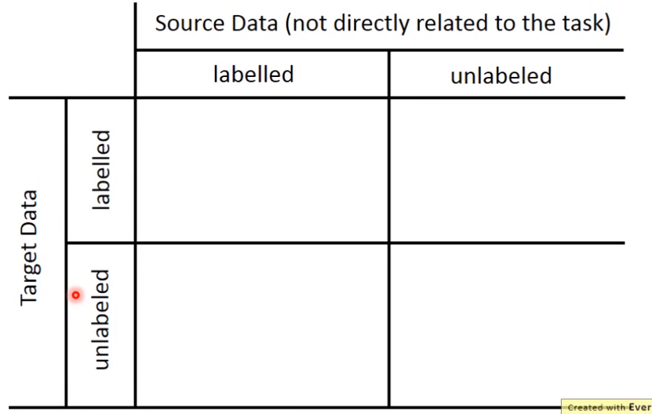
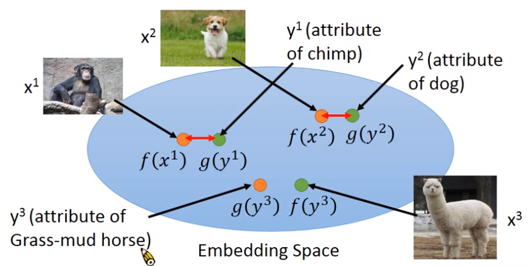

# Transfer Learning

> Examples：
>
> 1. 一样是动物图片（same domain），一个任务是分类猫和狗，另一个任务是分类大象和老虎；
> 2. 图片不同了（different domain），一个任务是分类猫和狗，另一个任务是分类动漫人物
> 3. 训练"台语识别"，从网络上下载中文的语音

### Overview

> Transfer Learning可分为4个象限

> 如果Target Data和Source Data都是labelled，可以用Model Fine-tuning

### Model Fine-tuning

- Target data$(x^t,y^t)$，数量很少（如果过于少，就叫one-shot learning）
- Source data$(x^s,y^s)$，数量较多

**Model Fine-tuning Example：speaker adaption**

例如要识别某个人的声音，但实际上这个人的声音只有几分钟，而其它的语音可以有几个小时。

一般来说Fine-tuning是把模型先在source data上预训练，训练的结果看作是**真正训练**的**初始值**，然后再去target data上去训练。

为了避免预训练的结果在target-data上被彻底破坏掉，可以加一些constrant，例如让新的model和旧的model在看到同样的data时的输出尽量相同，或者让新的model和旧的model的参数越相似越好。

**Model Fine-tuning Method：Layer Transfer**

例如我们可以把预训练得到的模型只复制其中几层的参数到实际的模型，而之后只用target-data训练没有复制参数的那几层。

Speech：一般复制最后几层layer，（因为语音的后面几层可以认为是和具体人不相关的）

Image：一般复制前面几层，（例如CNN前几层只做简单的pattern的识别，例如识别直线、直角）

从论文结果来看，"而之后只用target-data训练没有复制参数的那几层"改成"用target-data连同复制的几层一起训练"结果还是最好的。

> 如果Target Data和Source Data都是labelled，还可以用Multitask Learning

### Multitask Learning

Multitask Learning同时关心在source domain和target domain上表现得好不好。

> 感觉和上面的Transfer Layer差不多，如果input feature相同就是左图，否则是右图。在实际中有人用欧洲语言的数据先训练语音识别模型，然后再复制前面几层再训练中文识别，效果就比只用相同数量的中文数据训练出的模型好很多。
>
> 

> 如果Target Data是unlabeled，Source Data是labelled，则可以用Domain-adversarial training

### Domain-adversarial training

例如我们有MNIST数据作为source data，同时我们也有一些花花绿绿的数字的图片作为target data。

其思想就是，如果我们不管source data和target data的差异，只单纯地把source data作为训练数据，把target data作为test数据，则结果会很差，其原因就是如果把NN的前几层看作是feature extraction的操作的话，**那么中间hidden layer的输出结果进行t-SNE降维后观察可看出source data的中间层输出和target data的中间层输出分布是完全不相关的，因此结果不好**。

Domain-adversarial training就是希望feature extractor的output是可以把不同domain的数据(image)混在一起，即把不同domain的特性消除掉。

#### Domain-adversarial training的做法

就是在前几层的后面增加domain classifier，domain classifier负责根据中间层输出$f$判断出这个是属于哪个domain的，label predictor则是原来的后面几层（负责识别数字的）。**而现在feature extractor就是既要骗过domain classifier也要让label predictor尽量产生正确的输出**。

之所以加上个label predictor就是为了防止训练过程使得"feature extractor只要产生全0就可以使domain classifier分辨不出"的现象发生。

#### Domain-adversarial training的训练

很简单，因为$\frac {\partial L_d}{\partial \theta_d}$是想让$L_d$更小，因此我们在其前面加个负号变成$\frac {\partial L_d}{\partial \theta_d}$再进行训练就是想让$L_d$更大。

这个和GAN都一样难训练。一定要让domain classifier奋力挣扎然后再broken。

> 如果Target Data是unlabeled，Source Data是labelled，还可以用Zero-shot learning

### Zero-shot learning

如果source data和target data是不同的任务，例如source data是猫和狗的图片，而target data是另一种完全没在source data中的图片（例如鸟的图片，PS：之前的domain-adversial例子都是数字图片但一个是MNIST和彩色的数字图）

> 语音识别中有些词汇就是training data中完全没出现过的，人们通过不识别单词，而是识别一个个音素phoneme来解决这一问题。

Zero-shot learning的思想和上述语音识别类似，**Representing each class by its attribute**。

就是说我们训练个NN去识别动物图片中是否有毛、有4条腿、有尾巴，得到对应识别出的vector。根据这个vector去已有的一个class-attr表中查找一个最相像的class作为识别结果。

#### Attribute embedding

**如果Attribute的数量太多，采用Embedding的思想**，就是说将每个数据$x$的attribute vector通过函数$f$转换成embedding space中的一个点，将每个class $y^i$的attribute vector通过函数$g$也转换成embedding space中的一个点，这样当看到未见过的$x$时也可以根据转换后的点离对应$y^i$最近将其归类。

**如果不知道一个class的attr vector，可以借用word vector当作动物的原始attr vector**，因为word vector其实就蕴含了这个word的相关意义，所以我们把每个class的名称word通过语料库提取出其word vector当作attr vector，然后再做embedding变换映射到embedding space上。

#### 关于Zero-shot learning的训练细节

根据上述分析，我们希望找到函数$f,g$使得每个样本及其标签映射后的embedding vector越相近
$$
f*,g*=arg\ \mathop {min}_{f,g}\sum_n ||f(x^n)-g(y^n)||_2
$$
但这样只考虑到$f(x^n)$和$g(y^n)$之间越相近越好，但实际上还应该让$f(x^n)$和$g(y^i),i\ne n$尽量距离远。
$$
f*,g*=arg\ \mathop {min}_{f,g}\sum_n max(0,k-f(x^n)\cdot g(y^n)+{max}_{m\ne n}f(x^n)\cdot g(y^m))
$$
如果要让此时这个Loss为0，则必须$f(x^n)\cdot g(y^n)-{max}_{m\ne n}f(x^n)\cdot g(y^m)>k$也就是说其必须和自己标签的相似度足够大（比到其他标签的距离最大值还大k）才行。这样训练出的Zero-shot才好。

#### Convex Combination of Semantic Embedding

这个图像识别系统只是提出了一种机制，丢进一个图片，输出其是lion还是tiger的各自概率，我们通过将lion和tiger的word vector分别乘以对应概率再求和，得到的一个新的word vector，就用新的word vector去语料库中找最接近，最后找到的就是liger(狮虎兽)，因此这样就相当于完成了transfer learning成功识别出了新的动物狮虎兽。

> Zero-shot Learning应用到翻译上面就可以是：不管什么语种，先转换成一种隐藏的vector，然后再去解这个vector到目标语种，就可以完成各种语种之间的转换，而**这个隐藏vector也就可以看作是一种机器自己发明的语言**。

### 回顾Overview四象限

关于source data没有label的情况老师没有细讲，只说了：

self-taught learning和semi-supervised的区别就在于semi-supervised的labeled data和unlabeled data是很接近的，而self-taught learning的区别就是两者不接近。

self-taught learning的思想就是在unlabeled 的source data中去训练出一个好的feature extractor，然后用这个去target data中去提取好的特征而已。

