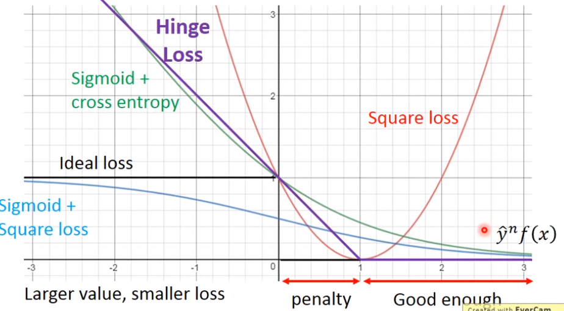
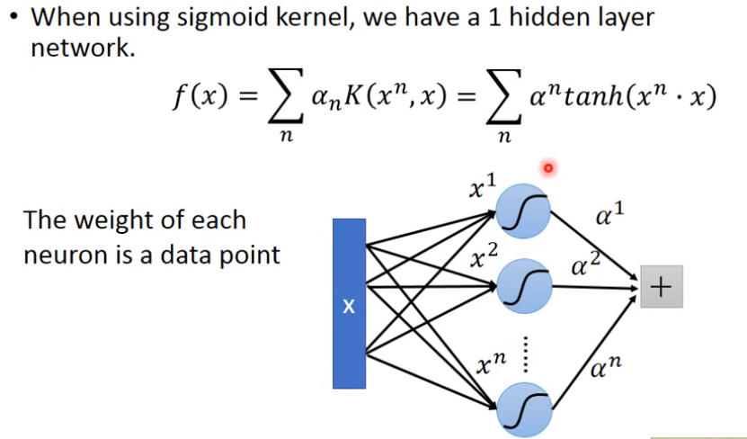

> SVM就是通过Kernel将$x$转换到一个更高维的空间的$\phi(x)$，再在这个更高维的空间中用Linear Classifier的方法对更高维空间的数据点$\phi(x)$进行分类，且SVM中这个Linear Classifier的Loss是Hinge Loss。并且SVM还采用了之后将介绍的Kernel Trick。即SVM = Hinge Loss + Kernel Trick
>
> PS：Linear Classifier就是类似$f(x)=wx+b$，如果f(x)>0输出1，否则输出-1的这种。
>
> PS：$\delta(x)$函数为如果x为true则函数值为1，否则为0

# SVM

### 回顾

假设现在进行二分类问题，
$$
g(x)=\lbrace
\begin{split}
&f(x)>0 \quad output=1 \\
&f(x)<0 \quad output=-1 \\
\end{split}
$$
Loss Function为
$$
L(f)=\sum_n l(f(x_n),\hat y_n)
$$

### 常见的Loss Function

Square Loss：
$$
l(f(x_n),\hat y_n)=(\hat {y_n}f(x_n)-1)^2
$$
Sigmoid + Square Loss：
$$
l(f(x_n),\hat y_n)=(\sigma(\hat {y_n}f(x))-1)^2
$$
Sigmoid + cross entropy：（是经过推导得到右边的公式）
$$
l(f(x_n),\hat y_n)=ln(1+exp(-\hat{y_n}f(x)))
$$

**Hinge Loss：**
$$
l(f(x_n),\hat y_n)=max(0,\quad1-\hat {y_n}f(x))
$$
综合分析：

横轴是$\hat {y_n} f(x)$，纵轴是loss，上图可以看到除了sigmoid+square loss，其它Loss都是在ideal loss的上面，是upper bound，因此我们优化这些upper bound是一定会有实际的效果的。而又可以看到square loss在$\hat {y_n} f(x)$大于1时反而会有很大的loss，因此不适合。

### Linear SVM

> 下面的所有$x$实际都是上述中将原始数据经过转换后得到的更高维空间中的$\phi(x)$，只不过简写为$x$了。

**Function：**
$$
f(x)=\sum_iw_ix_i+b
$$
**Loss Function：**
$$
\begin{split}
&L(f)=\sum_nl(f(x_n),\hat {y_n})+\lambda||w||_2 \\
&其中\\
&l(f(x_n),\hat {y_n})=max(0,1-\hat {y_n}f(x))
\end{split}
$$

**探究Loss Function的gradient：**
$$
\begin{split}
\frac {\partial l(f(x_n),\hat {y_n})}{\partial w_i} &= 
\frac {\partial l(f(x_n),\hat {y_n})}{\partial f(x_n)}\frac {\partial f(x_n)}{\partial w_i}
\end{split}
$$
其中
$$
\begin{split}
\frac {\partial l(f(x_n),\hat {y_n})}{\partial f(x_n)}&=\frac {\partial max(0,1-\hat{y_n}f(x_n))}{\partial f(x_n)} \\
&= \lbrace
\begin{split}
&-\hat {y_n} \quad if\ \hat {y_n}f(x_n)<1 \\
&0\quad otherwise
\end{split}
\end{split}
$$
下面的$x_i^n$是$x_n$的第$i$维度
$$
\frac {\partial f(x_n)}{\partial w_i}=x_i^n
$$
于是$\frac {\partial L(f)}{\partial w_i}$为
$$
\begin{split}
\frac {\partial L(f)}{\partial w_i}&=\sum_n-\delta(\hat {y_n}f(x_n)<1)\hat {y_n}x_i^n \\
&=\sum_n c^n(w)x_i^n
\end{split}
$$
于是
$$
w_i \leftarrow w_i-\eta\sum_n c^n(w)x_i^n
$$
**为什么这个Loss Function就是SVM**（Loss的另一种写法，在求出Min Loss后这两种方式的结果相同）：
$$
\begin{split}
&L(f)=\sum_n \epsilon^n+\lambda||w||_2 \\
&\epsilon^n\ge0 \\
&\epsilon^n\ge1-\hat {y_n}f(x_n) \quad \rightarrow \quad \hat {y_n}f(x_n)\ge1-\epsilon^n
\end{split}
$$
传统的SVM就可以用二次规划问题（求最优化）的方法求解上述方程.

**$f(x)$中求出来的权值向量$w$实际是由数据向量$x$线性组成的**

很简单因为w第$i$维的更新公式为
$$
w_i \leftarrow w_i-\eta\sum_n c^n(w)x_i^n
$$
即
$$
w \leftarrow w-\eta\sum_n c^n(w)x^n
$$
因此w就可以看作是各个$x$组成的
$$
w^*=\sum_n \alpha_n^*x^n
$$

> $\alpha_n$不为0的$x^n$就被称为support vector，即那些对计算分界线有帮助的数据，你拿掉那些不是support vector的数据后对SVM结果没任何影响。
>
> 如果不采用Hinge Loss而是采用sigmoid+cross entropy 则每个x都会是support vector（因为cross entropy的gradient都非0，而Hinge loss在$yf(x)$大于1时为0），这种就不太好，**采用了Hing Loss才叫SVM**。

**在知道$w$实际是由$x$线性组合而成后，便有**
$$
w=\sum_n \alpha_n x^n = X\alpha
$$
其中$X=[x^1\ x^2\ \dots\ x^N]$

因此$f(x)$为
$$
\begin{split}
f(x)&=\sum_n \alpha_n(x^n\cdot x)\\
&=\sum_n \alpha_n K(x^n,x)
\end{split}
$$
**注意注意注意**：

$\sum_n \alpha_n(x^n\cdot x)$的$x$代表的是将原始数据进行转换后得到的一个更高维数据。

而$\sum_n \alpha_n K(x^n,x)$中的$x$在后面将代表原始数据，而非$\phi(x)$。

**这就启发我们：**

在我们只有原始数据$x$而不知道该怎么转换成高维空间数据$\phi(x)$时，可以不需要设计了，只需要设计两个原始数据的K函数（Kernel函数），**并且保证$K(x_1,x_2)$是可以分成两个高维的$\phi(x)$和$\phi(y)$的inner product的值就可以**。这就是**Kernel Trick**。

通过Mercer's theory可以判断一个K函数是否可以分为两个高维向量$\phi(x)$的inner product。

### 几个著名的Kernel Function

**Radial Basis Function Kernel（RBF）**
$$
K(x,z)=exp(-\frac 12 ||x-z||_2)
$$
**Sigmoid Kernel**
$$
K(x,z)=tanh(x\cdot z)
$$

> Sigmoid Kernel会使$f(x)$变得和一个NN形式相同，
>
> 

