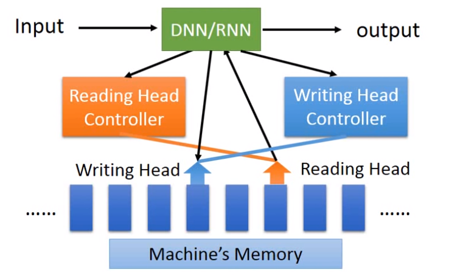

> Example Application
>
> - Slot Filling 从用户的语句中提取出关键信息。

RNN解决Slot Filling就是每次来一个词向量，就输出一个$a$，这个$a$也会被RNN暂存起来，同时$a$也会被用来产生这一时刻的输出$y$（即该词汇属于各个Slot的概率），因为RNN具有记忆，因此"leave Taipei"和"arrive Taipei"中的"Taipei"输入到RNN后输出的结果是会不同的。

#### RNN的分类

- Elman Network

  RNN的状态来自上一时刻的$a'$，由$a'$和input $x$产生$a$，再去生成输出$y$

- Jordan Network

  RNN的状态就是上一时刻的$y'$，由$y'$和input $x$产生$a$，再去生成输出$y$

#### BiRNN

好处就是既然看到了后面也看到了前面才生成的$y^t$

#### LSTM

> 传统RNN每次状态都会更新，因此实际上相当于只记得住前一时刻的状态

input gate、output gate、forget gate三个门的开关都是通过学习得到的。

LSTM实际上是4个inputs（input和三个门的控制信号），产生1个output。

**LSTM计算过程如下图**：其中$z_i,z_o,z_f,z$都是标量，$c,c'$是旧、新状态

但实际上$z_i,z_o,z_f,z$都是通过输入向量$x$通过一个神经元$w\cdot x+b$计算出来的，且它们之间的权值就是要被学习的对象，也就是说一个训练好的LSTM在对应的状态$c$时遇到输入$x$就可计算出相应$z_i,z_o,z_f,z$的值。

LSTM就看作原来NN中的一个普通的neuron就好，每次输入$x$都会先去产生LSTM需要的4个输入再产生一个输出$y$，从外部来看，LSTM和neuron表现为都是接受一个$x$产生一个$y$。

但LSTM是普通neuron需要的参数数量的4倍。

一整排的LSTM可以一起参与运算，下图中的$z_i,z_o,z_f,z,c_t,y_t,c_{t-1}$这些都不再表示标量而都是向量，向量的第$i$维就是第$i$个LSTM神经元的。这样就可以大幅度加快运算，例如来一个$\vec x$，就可通过$\vec {z_o}=\vec x \cdot w+\vec b$一下拿到了所有LSTM的输出门参数。

真实情况的LSTM输入$x$还会和当前状态$c$以及上一时刻的输出$h^t$拼接在一起形成一个大的$x'$再去做之前的运算。

#### RNN的训练

RNN的训练有时候Loss会突然出现NaN，然后程序就Segmentation Fault。

大致原因是由于RNN的error surface非常崎岖，例如悬崖那样，一开始模型是在平原所以学习率较大，而突然踩到了悬崖顶部的位置因此Loss突然增大，同时也可能刚在踩到峭壁上因此gradient也突然暴增，而较大的学习率乘以暴增的gradient，因此程序参数剧烈改变就可能导致越界segmentation fault。

RNN的作者用了Clipping解决这个问题，即给gradient限制一个最大值。

> PS：RNN一般不用ReLU

**RNN error surface很陡峭的原因**主要是由于RNN具有记忆的特性来的。
打个比方，$y=w^{1000}$这个式子中差不多就是代表w经过1000步迭代后还保留在RNN中的记忆，
如果$w$取1，那么$y$为1，如果$w$取1.01，那么$y$约为20000，因此可以说y相对于w的微分很大，但是如果$w$取0.99，那么$y$约为0，如果$w$取0.01，那么$y$还是为0，因此可以说y相对于w的微分很小，这样就可以看出RNN的error surface为何陡峭的原因。**gradient时大时小，学习率也不好设置**。

解决RNN error surface很差的方法之一是使用LSTM，但LSTM只会帮助error surface不会出现特别平坦的地方（gradient vanishing），但是还是避免不了特别陡峭的地方的出现（gradient explode）。这样就可以安心使用特别小的学习率$\eta$。

之所以LSTM可以解决gradient vanishing，是因为RNN在每一时刻其状态都会被刷新，而LSTM的状态是乘上遗忘门再加上放进来的部分input，因此在LSTM中一个数据的影响是可以持续很久的（if forgate gate is opened）。

> Tips：
>
> **GRU是LSTM的简化版**，只有两个门，把input gate 和 forget gate结合了，要取新数据就要洗掉旧状态。
>
> 如果用Identity Matrix初始化RNN的参数，那么用ReLU比较好。

#### RNN应用

1. RNN也适合多对一的任务，例如句子的情感识别、文章关键词提取；

2. RNN也适合N对n的任务(n<N)，例如语音识别；

3. RNN也适合N1对N2的任务(N1和N2的大小不知道)，例如机器翻译；

   > RNN在这部分的应用感觉就比较"暴力"：
   >
   > 例如直接给英语语音和对应的中文，RNN训练后就可以直接把英语语音翻译成中文了；
   >
   > 例如直接给RNN一句话，label是一个语法树的中序遍历(带括号的那种)，这样RNN就可以学会根据句子生成语法树结构了。（神奇的是LSTM不会忘记加左右括号，就很离谱）

4. RNN还可以作为文章、语音这种东西的编码器，即把一些变长的时序数据给编码成一个固定长度的vector，使意思相近的语音、文章的vector相近；

   > 这种方法可以用来语音的检索之类的应用。例如相似视频推荐、相似文章推荐（因为它们的vector相近）

   > **要训练encoder必须要搭配decoder一起训练**，即decoder必须朝着从encoder的编码中还原数据的方向去训练，只有在这过程中decoder能够还原回原始数据时encoder的编的码才会具有上述的相似内容的文章的vector相近的性质。
   >
   > 

#### CTC

在语音辨识中，先是会产生"好好棒棒棒"，一般这种条件下我们就需要进行trimming得到"好棒"。
而如果用户本来说的就是"好棒棒"的话就会少识别一个"棒"字。

解决方法是**Connectionist Temporal Classification(CTC)**，即在可能输出的结果中添加空置NULL，这样上面的"好好棒棒棒"就会是"好null棒null null"，而"好棒棒"就是"好null棒null棒"。

对CTC的训练问题就是对应一个labeled data，我们不知道例如"好棒"是对应五个帧中的"好 null 棒 null null"还是"好 棒 null null null"还是"好 null null null 棒"等等。采用的解决方法就是穷举法，穷举所有可能的对应关系都当成是对的，都一起训练。

#### 机器翻译

为了让机器知道什么时候停下来，可以增加个symble，就例如stop，当机器输出为stop时就将翻译过程停止。

#### Attention-based RNN

**大致思想**：读入输入$x$，产生**reading head**（Reading head就差不多是Attention）和writing head，reading head决定要输出哪个存储的信息，writing head决定要更改的是哪个信息。

#### Reading Comprehension

有这种思想还有RNN在Reading Comprehension方面上的应用，就是输入用户问的问题$x$，DNN/RNN就去记忆中寻找哪些信息可以组合成答案返回给用户。

同样也可以是给machine听一段语音、看一张图，然后让machine回答问题之类的。然而RNN做的工作基本上都是把这些感受到的数据（转换成一个vector）存储到Machine's Memory中，然后再根据输入的问题输出Reading Head Controller之类去组织问题的答案返回给用户。

例如听一段语音回答问题这种，首先对问题文字做语义分析得到$x$，再听取语音做Speech Recognition以及语义分析得到Machine's Memory，然后RNN根据$x$就可得到对应的Attention，这样模型就根据Attention可以去Memory中进行产生答案。再把答案和每个选项计算相似度，选择相似度最高的选项作为返回的答案。

### Structured Learning VS RNN

Structured Learning，传统的SVM、HMM中可以轻易地加一些Constrain，例如希望每个label出现的时候都要连续出现五次；而RNN这种Deep Learning就不能加Constrain；

Structured Learning，传统的SVM、HMM中的Cost就是Error的upper bound；而RNN中的每一步训练的error（例如cross entropy）并不是整个识别结果的cost（例如识别出的sequence和标签sequence之间的相似度）

> Structured Learning和RNN可以结合起来，一起gradient descent

> PS：structured learning在ML课中没讲，其实就是解三个问题：
>
> 1. find evaluation function
>
>    给出x和y，F(x,y)就是评价y是否是x的label的函数，F(x,y)越大代表越好
>
> 2. find best x
>
>    就是说有了F(x,y)后，给出x，如何求y，使得F(x,y)最大的问题
>
> 3. how to train
>
>    这个就是说如何进行训练的问题

