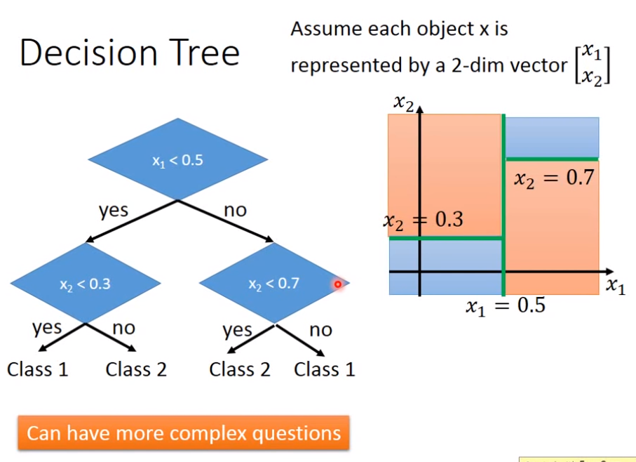
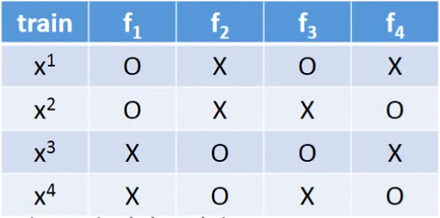

# Bagging

Bagging的做法就是假设当前有N个数据，则有放回地抽取N‘个数据，重复m次，对于这个m个N’大小的数据进行分别训练，分别得到m个子模型。之后输入一个testing data就输入到所有子模型中去，对m个输出进行average或voting。

Bagging方法对于complex的模型即很容易overfit的模型有用。

> NN其实不容易overfit，decision tree容易（决策树如果不限制高度的话，其实永远都可以做到在训练数据上error为0）

> Random Forest实际就是decision tree的bagging版本。

### 拓展：Decision Tree

树中的问题不一定非要是只关于一维的，老师说也可以是关于更多维的。

**Random Forest**不仅仅是每次resample N‘个数据，而且在树每次产生分支时会随机限制不能选择哪些feature作为分支question。

### Out-of-bag validation for bagging

Out of bag的validation方法就是说假设原始trainning data 分为4份x1,x2,x3,x4，其中f1是用x1,x2训练出来的，f2是用x3,x4训练出来的，...，这样我们就可以用x1去测试f2+f4的效果，用x2去测试f2+f3的效果，...

就是保证测试的模型f没见过x即可。

# Boosting

Bagging一般是用在很强的model（很容易overfit的model），而Boosting就是一般用在弱的model（难以fit data）。

> 就算每个classifier的正确率只比50%高一点点，boosting也能让它们最后的error几乎为0

Boosting的过程就是先训练出f1，然后根据f1训练出一个f2来辅助f1...

### 得到不同训练集的方法

之前是通过resample得到不同的训练集，现在可以就为每个data赋不同的权值w，使得
$$
L(f)=\sum_i w_il(f(x_i),\hat {y_i})
$$
之前的resample方法也可以看作是赋不同权值，只不过数值为整数，例如被重复抽到两次的data就是权值为2。

### Adaboost

#### Adaboost：找新的training data

假设已经训练出了$f_1$，目前第$i$个training data的权值为$w^i_1$，且当前$f_1$在目前的权值分布的training data上的error rate是$\epsilon_1$（显然$\epsilon_1$是小于0.5的，分类器的错误率肯定不可能超过0.5否则输出取反就可以小于0.5），目前所有权值之和为$Z_1$。

现在就是想找出新的权值分布$w_2^i$使得原来的$f_1$在其上面的error rate为0.5。即
$$
\frac {\sum_i w^i_2 \delta(f_1(x^i)\ne \hat {y^n})}{Z_2}=0.5
$$
那么就是让原来f1正确的那些数据的权值减小，原来错误的数据权值增大，这样才能使"使f1错误的数据的权值之和"等于"使f1正确的数据权值之和"，假设减小就是除以$d_1$，增大就是乘以$d_1$
$$
\sum_{f_1(x^i=\hat {y^i})} w^i_1/d_1=\sum_{f_1(x^i\ne \hat {y^i})} w^i_1d_1
$$
即
$$
\frac 1{d_1}\sum_{f_1(x^i=\hat {y^i})} w^i_1=d_1 \sum_{f_1(x^i\ne \hat {y^i})} w^i_1 \\
\frac 1{d_1} Z_1(1-\epsilon_1)=d_1Z_1\epsilon_1
$$
最后可得
$$
d_1=\sqrt {(1-\epsilon_1)/\epsilon_1}
$$
实际过程中可以写成
$$
\alpha_1=ln\sqrt {(1-\epsilon_1)/\epsilon_1}
$$
之前的数据权值在乘以d1或者除以d1时就改用乘以$exp(d1)$或乘以$exp(-d1)$，只相差一个负号便于式子的合写为一个式子。因此权值更新公式就为
$$
w^i_{t+1}=w^i_{t} *exp(-\hat {y^i}f_t(x^i)\alpha_t)
$$

> $-\hat {y^i}f_t(x^i)$就是正确数据为-1，错误数据为1

#### Adaboost：训练过程

所有训练数据的权值初始为1，然后按照上面的步骤就可以进行不断迭代。

假设得到了多个function f1,f2,...,ft,...如何整合？思想就是训练过程中准确率大的权值就大，准确率低的权值就低，即

> 这里假设是二分类问题，最后的结果是正就是1，是负就是-1

$$
H(x)=sign(\sum_t \alpha_tf_t(x))
$$

其中$\alpha_t$就可以取上面的$ln\sqrt {(1-\epsilon_1)/\epsilon_1}$，当$\epsilon$小时其值就大。反之则小。

#### Adaboost：理论证明 Warning of Math

> 证明：随着$f_t$越来越多，最后的error越来越小

> 假设：二分类问题，N个数据，T次迭代
> $$
> \begin{split}
> &H(x)=sign(\sum_{t=1}^T \alpha_t f_t(x)) \\
> &\alpha_t=ln\sqrt {(1-\epsilon_1)/\epsilon_1}
> \end{split}
> $$
取：$g(x)=\sum_{t=1}^T \alpha_t f_t(x)$

则Training data error rate为
$$
\begin{split}
&=\frac 1N\sum_i\delta(H(x^i)\ne \hat {y^i}) \\
&=\frac 1N\sum_i\delta(\hat {y^i}g(x^i)<0) \\
&\le \frac 1N\sum_i exp(-\hat {y^i}g(x^i)) \\
&(画个以\hat {y^i}g(x^i)为x轴的图就可以知道)
\end{split}
$$

> 接下来就只需证明这个upper bound越来越小

回顾之前的权值更新式子
$$
\begin{split}
&w^i_1=1 \\
&w^i_{t+1}=w^i_{t} *exp(-\hat {y}^if_t(x^i)\alpha_t)
\end{split}
$$
于是有
$$
\begin{split}
w^i_{T+1}&=\prod_{t=1}^T exp(-\hat {y}^if_t(x^i)\alpha_t) \\
&=exp(-\hat y^i\sum_{t=1}^Tf_t(x^i)\alpha_t) \\
&=exp(-\hat y^ig_T(x^i))
\end{split}
$$
于是有
$$
\begin{split}
Z_{T+1}&=\sum_i\prod_{t=1}^T exp(-\hat {y}^if_t(x^i)\alpha_t) \\
&=\sum_iexp(-\hat y^i\sum_{t=1}^Tf_t(x^i)\alpha_t) \\
&=\sum_iexp(-\hat y^ig_T(x^i))
\end{split}
$$
因此之前求的error rate的upper bound为
$$
\le \frac 1N\sum_i exp(-\hat {y}^ig(x^i)) = \frac 1NZ_{T+1}
$$
推导$Z_t$的更新式子
$$
\begin{split}
Z_{t}&=Z_{t-1}\epsilon_t\sqrt{(1-\epsilon_t)/\epsilon_t}+Z_{t-1}(1-\epsilon_t)\sqrt{\epsilon_t/(1-\epsilon_t)} \\
&=Z_{t-1}*2\sqrt{\epsilon_t(1-\epsilon_t)}
\end{split}
$$
而$2\sqrt{\epsilon_t(1-\epsilon_t)}$小于1，因此$Z_t$越来越小，因此upper bound越来越小，证毕。

#### Adaboost：一些问题和分析

问题1：

Adaboost即使在training data上的error rate已经为0，随着迭代次数的增加仍可以使模型在testing data上的error rate进一步下降。

分析1：

error rate为0只需要$\hat y$ 和$g(x)$同号即可，但是如果使$\hat y g(x)$越大的话则可以使模型的robust效果提升，即不止要分得正确，还要分得明显。

> 称$\hat y g(x)$为**Margin**。

之前的Training Data Error Rate进一步可化为
$$
\begin{split}
&\le \frac 1N\sum_i exp(-\hat {y}^ig(x^i)) \\
&= \frac 1NZ_{T+1} \\
&=\prod_{t=1}^T 2\sqrt{\epsilon_t(1-\epsilon_t)}
\end{split}
$$
很显然也是随着t增加而减少，因此会有上述现象发生。

### Gradient Boosting(后半部分没听懂)

> 回顾：
>
> $g_t(x)=\sum_{t=1}^t \alpha_t f_t(x)$
>
> 则：
>
> $g_0(x)=0$
>
> $g_t(x)=g_{t-1}(x)+\alpha_t f_t(x)$，$H(x)=sign(g_T(x))$

**则每一步就是去找$\alpha_t$和$f_t(x)$**

训练的目标函数就是
$$
Minimize\ L(g)=\sum_i l(\hat y^i,g(x^i))=\sum_i exp(-\hat y^ig(x^i))
$$
Gradient Descent：
$$
g_t\leftarrow g_{t-1}-\eta\frac {\partial L(g)}{\partial g}|_{g=g_{t-1}}
$$

> 这里把函数g看作是Loss的参数了，老师说其实g就可以看作是很多个点连成的线，因此g就可以看作是一个向量，每个元素就是个点而已，因此可以对L做g的微分。

> 这里就是如果$+\alpha_t f_t(x)$方向和$-\eta\frac {\partial L(g)}{\partial g}|g=g_{t-1}$一致，则新的$g_t$就是朝着正确的方向去更新的。

因为L式子$\sum_i exp(-\hat y^ig_{t-1}(x^i))$，因此L对$g_{t-1}$的微分为
$$
\begin{split}
-\frac {\partial L(g)}{\partial g}|_{g=g_{t-1}}&=-\sum_i exp(-\hat y^ig_{t-1}(x^i))(-\hat y^i) \\
&=\sum_i exp(-\hat y^ig_{t-1}(x^i))\hat y^i
\end{split}
$$
因此希望$f_t(x)$同$\sum_i exp(-\hat y^ig_{t-1}(x^i))\hat y^i$符号相同，也就等价于使下面式子最大化
$$
Maximize\ \sum_i exp(-\hat y^ig_{t-1}(x^i))\hat y^if_t(x^i)=\sum_i w^i_t\hat y^if_t(x^i)
$$
其中$w_t^i$就是Adaboost的weight。根据这个式子可以知道此式子找出来的下一个$f_t$实际就是Adaboost中把$w_{t-1}$变成了$w_t$后又训练出来得到的$f_t$。因此可以说gradient boosting和adaboost等价。

> 可以说Adaboost就是在做上述的Gradient Boosting。

给定$f_t$后就是要去找$\alpha_t$，使得$L(g)$最小。
$$
L(g)=\sum_i exp(-\hat y^i(g_{t-1}(x^i))+\alpha_tf_t(x^i))
$$
对上式求$\alpha_t$的微分，令其等于0，解出的$\alpha_t$刚好就是Adaboost中的$\alpha_t=ln\sqrt{\epsilon_t(1-\epsilon_t)}$

> 重复一次：可以说Adaboost就是在做上述的Gradient Boosting。

# Stacking

单纯地把不同Classifier放在一起，并通过Average或Voting使结果结合起来，会让那些弱者拖累强者。

Stacking的做法就是**再在后面添加个Final Classifier**来把前面堆起来的几个Classifier的输出当作Feature，然后再把最终结果输出出来。

这里要注意的就是**训练各个Classifier和训练Final Classifier的数据要不同**，因为最终Final Classifier相当于是给前面的Classifier打分，所以必须"给他们没做过的期末卷子作为考试"。

