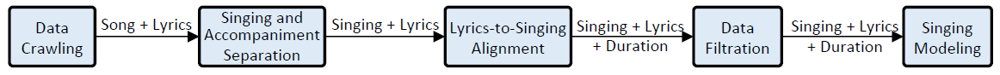

# DeepSinger

DeepSinger分为五大模块，本文也将从这五大模块分别介绍。

### DataCrawling

1. 用Python中的Requests库搭建了爬虫，爬取音乐网站HTML网页，提取歌手id，并进入该歌手的主页中下载其歌曲以及对应歌词。
2. 丢弃长于5分钟的歌曲，丢弃演唱会版本的歌曲，丢弃乐队唱的歌曲，丢弃音乐的meta information，**保留**歌词中句子分割符号(separation marks).
3. 作者还利用到了一些公开数据集帮助音乐综合模块(singing model)的训练，例如中文的THCHS-30。
4. 作者将所有的audio转换成22050Hz.
5. 使用Python中的pypinyin将中文歌词转为音素(phoneme)

### Singing and Accompaniment Separation

这部分作者借助的是开源工具Spleeter将人声和背景音乐声分离出来。并对人声分别提取mel频谱和linear频谱数据，使用的window大小为1024，window offset为256.

> 经过以上两步骤，我们便可得到许多首歌曲，且提取出了每首歌曲人声部分的$\left[ mel频谱,linear频谱,音素序列\right]$

### Lyrics to Singing Alignment

> 这部分作者的思路是先按句子对齐，再在每个句子中把每个音素对齐，但是在论文中作者貌似没说句子怎么对齐并切分。

首先模型是一个Encoder-Attention-Decoder的模型，其中的Attention矩阵就是一个纵轴为音素，横轴为时间的矩阵，例如下图

这个模型以mel频谱、音素序列作为输入，希望decoder能够生成和原来相同的音素序列，以此进行训练。

当然我们希望模型产生的Attention矩阵就如上图那样是一个对角矩阵，这样就可以很容易地进行音符对齐，例如下图

在Loss Function中加上相应惩罚项就可以Model中的Attention矩阵逐渐朝着一个对角矩阵变换。例如下图

假设Attention矩阵为$A$，对角矩阵Mask为$D$，很显然我们希望$A\cdot D$(矩阵点乘，即对应元素相乘)越大越好，取负数$-A\cdot D$即可越小越好，新的Loss就变为
$$
L'=L-\eta A\cdot D
$$
这样当我们希望$L'$越小则$A\cdot D$会越来越大，因此Attention矩阵就会越来越像对角矩阵。

假设我们已经得到一个类似对角矩阵的Attention矩阵$A$，那么如何决定不同音素之间的boundary呢？答案就是动态规划即可：

1. 设$O_{i,j}$的含义为：将下标从0到j的帧分成i+1个段，对每个段，例如第$x$段我们把段中元素$A_{x,y}$进行求和的最大值（即第$x$段我们就加上第$x$行的元素）。具体如下图：

   

   很明显，左边切分方法就比右边的切分方法更好，而在论文的动态规划就是要找一个最大的$O_{i,j}$，其中动态规划的转移方程如下：
   $$
   \begin{split}
   &for\ each\ k\ ∈ [0,S) \\
   &\qquad O_{i,j}=max(O_{i-1,k}+C_{i,j}-C_{i,k},\ O_{i,j})
   \end{split}
   $$
   其中$C_{i,j}=\sum_{k=0}^j A_{i,k}$，即Attention矩阵中第$i$行前$k$个元素之和(前缀和)

2. 在上述寻找最大的$O_{i,j}$的过程中，会记录矩阵元素$B_{i,j}$，其含义就是$O_{i,j}$切分成的段中最后一段的起始帧为$B_{i,j}$

3. 有了上述$B_{i,j}$元素后，我们就可以得到每个音素的持续时间$D$，其原理大概是，因为$B_{i,j}$记录的是将前$j$个帧分成$i+1$段时最后一段音素的起始帧为$k$，因此就可以知道倒数第二个音素的起始帧为$B_{i-1,k}$，即把前$k$个帧分为$i-1$段时最后一个音素的起始帧。因此作者通过如下算法得到每个音素的Duration：
   $$
   \begin{split}
   &P=S-1 \\
   &for\ each\ i\in\ [T-1, 0]\ do \\
   &\quad \begin{split}
   &D_{i}=P-B_{i,P} \\
   &P=B_{i,P}
   \end{split}
   \end{split}
   $$

   > T是音素个数，S是帧个数

补充说明：这里作者开始时候说会先把音乐按照句子进行对齐，然后再在单个句子上按照音素对齐，但实际上论文中貌似并没有说怎么将原本的完整的音乐按照一句一句地对齐，而是刚开始时设$L=10\%$，即每次取$L*T$个音素尝试进行对齐（$T$是这首歌的音素总数），进行完一轮的训练后再将$L$增加2%，以这种每个epoch多2%的步伐逐渐将$L$扩展到100%。即最终我们可以一次性就把整首歌曲的音素对齐。

### Data Filtration

这里的过滤就是说上一步计算出的$O_{i,j}$如果小于0.6就丢弃这个样本，即我们只留下对齐效果不错的样本。

### Singing Modeling

这里忘记说明了，作者在收集一首歌曲时，也调用了Parsemouth库提取了歌曲的基音频率F0作为一帧的频率，即pitch序列。

因此这里总结一下，到这一步时，已经拿到了一首歌曲的audio文件、linear频谱序列、mel频谱序列、duration序列、phoneme(音素)序列、pitch序列。

音乐综合模型的结构如下：（基于FastSpeech模型）

总体来说就是3个Encoder，encode出来的vector拼接在一起组成一个长的vector再送到Decoder中去直接生成linear频谱，再调用开源工具Griffin-Lim直接从linear频谱生成对应的wav文件。

#### LyricsEncoder

每个音素是一个值，音素id，通过Embedding层转成vector，再经过几层transformer，最后将序列长度expand成对应duration需要的长度。

#### PitchEncoder

每个音符也经过Embedding层转成vector，再经过transfomer（这里不需要根据duration扩展长度，因为原本就是一帧一个pitch）

#### ReferenceEncoder

将传入的"reference音乐"的每帧linear频谱经过pre-net预处理后，送入几层transformer，最后经过一个avg pooling将每一帧的数据从一个矩形压缩成一个vector。

#### Decoder

Decoder就是几层transform，最后再通过一个linear网络（全连接网络？）将hidden vector转换成一个linear spectrum。

最后的最后，将linear spectrum序列通过Griffin-Lim库生成音乐文件。

Singing Model的Loss是decoder生成出的linear频谱与传入的reference音乐的linear频谱之间的MSE误差，在此基础上再用优化器优化即可。

